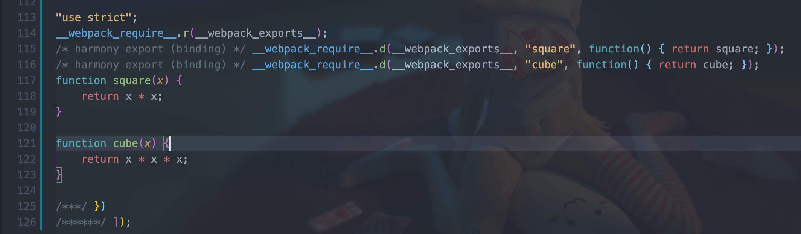

<div style="text-align:center;">
    <h1>webpack使用指南</h1>
    
</div>

***本项目是本人跟随webpack官网指南章节篇创建，旨在理解webpack各工具的使用方法的过程中，能更容易深入到其他更深层次的文章中。***

### 安装
#### 本地安装
要安装最新版本或特定版本，请运行以下命令之一：
```sh
npm install --save-dev webpack
npm install --save-dev webpack<@version>
```
如果使用 webpack 4+ 版本，还需要安装 CLI。
```sh
npm install --save-dev webpack-cli
```
> 这里先留一个疑问，为什么需要安装CLI?

对于大多数项目，建议本地安装。这可以使webpack在引入破坏式变更(breaking change)的依赖时，更容易分别升级项目。

### 起步

#### 基本安装

项目初始化，在项目路径下执行
```sh
npm init -y
npm install --save-dev webpack webpack-cli
```

此时，项目目录结构，文件内容如下：

project

```diff
	./fellow_guanwang/
	├── README.md
+ ├── index.html
+ ├── package-lock.json
+ ├── package.json
+ ├── src
+ │   └── index.js
+ └── static
+    └── imgs
```

src/index.js

```js
function component() {
    var element = document.createElement('div');
  
    // Lodash（目前通过一个 script 脚本引入）对于执行这一行是必需的
    element.innerHTML = _.join(['Hello', 'webpack'], ' ');
  
    return element;
}
  
document.body.appendChild(component());
```

Index.html

```html
<!doctype html>
<html>
  <head>
    <title>起步</title>
    <script src="https://unpkg.com/lodash@4.16.6"></script>
  </head>
  <body>
    <script src="./src/index.js"></script>
  </body>
</html>
```

我们还需要调整 `package.json` 文件，以便确保我们安装包是`私有的(private)`，并且移除 `main` 入口。这可以防止意外发布你的代码。

> *如果你想要了解* `package.json` *内在机制的更多信息，我们推荐阅读* [npm 文档](https://docs.npmjs.com/files/package.json)*。*

package.json

```diff
{
  "name": "fellow_guanwang",
  "version": "1.0.0",
  "description": "",
- "main": "index.js",
+ "private": true,
  "scripts": {
    "test": "echo \"Error: no test specified\" && exit 1"
  },
  "keywords": [],
  "author": "",
  "license": "ISC",
  "devDependencies": {
    "webpack": "^4.41.5",
    "webpack-cli": "^3.3.10"
  }
}
```

在此示例中，`<script>` 标签之间存在隐式依赖关系。`index.js `文件执行之前，还依赖于页面中引入的 `lodash`。之所以说是隐式的是因为 `index.js` 并未显式声明需要引入`lodash`，只是假定推测已经存在一个全局变量 `_`。

使用这种方式去管理 JavaScript 项目会有一些问题：

- 无法立即体现，脚本的执行依赖于外部扩展库(external library)。
- 如果依赖不存在，或者引入顺序错误，应用程序将无法正常运行。
- 如果依赖被引入但是并没有使用，浏览器将被迫下载无用代码。

让我们使用 webpack 来管理这些脚本。

#### 创建一个bundle文件

首先，需要调整下目录结构，将“源”代码(`/src`)从我们的“分发”代码(`/dist`)中分离出来。“源”代码是用于书写和编辑的代码。“分发”代码是构建过程产生的代码最小化和优化后的“输出”目录，最终将在浏览器中加载：

project:

```diff
  ./fellow_guanwang/
  ├── README.md
- ├── index.html
+ ├── dist
+ │   └── index.html
  ├── package-lock.json
  ├── package.json
  ├── src
  │   └── index.js
  └── static
      └── imgs
```

要在 `index.js` 中打包 `lodash` 依赖，我们需要在本地安装 library：

```sh
npm install --save loadsh
```

> *在安装一个要打包到生产环境的安装包时，你应该使用* `npm install --save`*，如果你在安装一个用于开发环境的安装包（例如，linter, 测试库等），你应该使用* `npm install --save-dev`*。请在* [npm 文档](https://docs.npmjs.com/cli/install) *中查找更多信息。*

现在，在我们的脚本中 import `lodash`：

src/index.js

```diff
+ import _ from 'loadsh';
+
  function component() {
     var element = document.createElement('div');
   
-    // Lodash（目前通过一个 script 脚本引入）对于执行这一行是必需的
+    // Loadsh 现在通过import导入
     element.innerHTML = _.join(['Hello', 'webpack'], ' ');
   
     return element;
   }
  
	 document.body.appendChild(component());

```

现在，由于通过打包来合成脚本，我们必须更新 `index.html` 文件。因为现在是通过 `import` 引入 lodash，所以将 lodash `` 删除，然后修改另一个 `` 标签来加载 bundle，而不是原始的 `/src` 文件：

dist/index.html

```diff
	<!doctype html>
  <html>
   <head>
     <title>起步</title>
-    <script src="https://unpkg.com/lodash@4.16.6"></script>
   </head>
   <body>
-    <script src="../src/index.js"></script>
+    <script src="./main.js"></script>
   </body>
  </html>

```

在这个设置中，`index.js` 显式要求引入的 `lodash` 必须存在，然后将它绑定为 `_`（没有全局作用域污染）。

通过声明模块所需的依赖，webpack 能够利用这些信息去构建依赖图，然后使用图生成一个优化过的，会以正确顺序执行的 bundle。

可以这样说，执行 `npx webpack`，会将我们的脚本作为[入口起点](https://www.webpackjs.com/concepts/entry-points)，然后 [输出](https://www.webpackjs.com/concepts/output) 为 `main.js`。Node 8.2+ 版本提供的 `npx` 命令，可以运行在初始安装的 webpack 包(package)的 webpack 二进制文件（`./node_modules/.bin/webpack`）：

```sh
npx -webpack

Hash: 3578d217ee0ed84bacaa
Version: webpack 4.41.5
Time: 2747ms
Built at: 2020-02-07 23:50:05
  Asset    Size  Chunks             Chunk Names
main.js  72 KiB       0  [emitted]  main
Entrypoint main = main.js
[1] ./src/index.js 265 bytes {0} [built]
[2] (webpack)/buildin/global.js 472 bytes {0} [built]
[3] (webpack)/buildin/module.js 497 bytes {0} [built]
    + 1 hidden module

WARNING in configuration
The 'mode' option has not been set, webpack will fallback to 'production' for this value. Set 'mode' option to 'development' or 'production' to enable defaults 
for each environment.
You can also set it to 'none' to disable any default behavior. Learn more: https://webpack.js.org/configuration/mode/
```

构建好后project：

```diff
    ./fellow_guanwang/
  ├── [6.9K]  README.md
  ├── dist
  │   ├── [ 132]  index.html
+ │   └── [ 72K]  main.js
  ├── [140K]  package-lock.json
  ├── [ 356]  package.json
  ├── src
  │   └── [ 265]  index.js
  └── static
      └── [  96]  imgs
```

> *输出可能会稍有不同，但是只要构建成功，那么你就可以继续。并且不要担心，稍后我们就会解决。*

在浏览器中打开 `index.html`，如果一切访问都正常，你应该能看到以下文本：'Hello webpack'。

> 可以看到打包后的文件居然达到了72k，体积明显大了很多，这也是使用打包的缺点。

#### 模块

[ES2015](https://babeljs.io/learn-es2015/) 中的 [`import`](https://developer.mozilla.org/en-US/docs/Web/JavaScript/Reference/Statements/import) 和 [`export`](https://developer.mozilla.org/en-US/docs/Web/JavaScript/Reference/Statements/export) 语句已经被标准化。虽然大多数浏览器还无法支持它们，但是 webpack 却能够提供开箱即用般的支持。

事实上，webpack 在幕后会将代码“转译”，以便旧版本浏览器可以执行。如果你检查 `dist/bundle.js`，你可以看到 webpack 具体如何实现，这是独创精巧的设计！除了 `import` 和 `export`，webpack 还能够很好地支持多种其他模块语法，更多信息请查看[模块 API](https://www.webpackjs.com/api/module-methods)。

注意，webpack 不会更改代码中除 `import` 和 `export` 语句以外的部分。如果你在使用其它 [ES2015 特性](http://es6-features.org/)，请确保你在 webpack 的 [loader 系统](https://www.webpackjs.com/concepts/loaders/)中使用了一个像是 [Babel](https://babeljs.io/) 或 [Bublé](https://buble.surge.sh/guide/) 的[转译器](https://www.webpackjs.com/loaders/#transpiling)。

#### 使用一个配置文件

在 webpack 4 中，可以无须任何配置使用，然而大多数项目会需要很复杂的设置，这就是为什么 webpack 仍然要支持 [配置文件](https://www.webpackjs.com/concepts/configuration)。这比在终端(terminal)中手动输入大量命令要高效的多，所以让我们创建一个取代以上使用 CLI 选项方式的配置文件：

**project**

```diff
  ./fellow_guanwang/
  ├── README.md
  ├── dist
  │   ├── index.html
  │   └── main.js
  ├── package-lock.json
  ├── package.json
  ├── src
  │   └── index.js
  ├── static
  │   └── imgs
+ └── webpack.config.js
```

**webpack.config.js**

```js
const path = require('path');

module.exports = {
    entry: "./src/index.js",
    output: {
        filename: 'bundle.js',
        path: path.resolve(__dirname, 'dist')
    }
}
```

现在，让我们通过新配置文件再次执行构建

```shell
npx webpack --config webpack.config.js

Hash: 3578d217ee0ed84bacaa
Version: webpack 4.41.5
Time: 378ms
Built at: 2020-02-08 00:16:55
  Asset    Size  Chunks             Chunk Names
main.js  72 KiB       0  [emitted]  main
Entrypoint main = main.js
[1] ./src/index.js 265 bytes {0} [built]
[2] (webpack)/buildin/global.js 472 bytes {0} [built]
[3] (webpack)/buildin/module.js 497 bytes {0} [built]
    + 1 hidden module

WARNING in configuration
The 'mode' option has not been set, webpack will fallback to 'production' for this value. Set 'mode' option to 'development' or 'production' to enable defaults 
for each environment.
You can also set it to 'none' to disable any default behavior. Learn more: https://webpack.js.org/configuration/mode/
```

> ***为什么构建出来是main.js而不是bundle.js？后来排查到时将配置文件中的export写错了，导致配置文件失效，任然用的默认打包方式。***

**修改完后重新执行**

```sh
npx webpack --config webpack.config.js

Hash: 1d32ddb2222f6868fc98
Version: webpack 4.41.5
Time: 359ms
Built at: 2020-02-08 00:25:40
    Asset    Size  Chunks             Chunk Names
bundle.js  72 KiB       0  [emitted]  main
Entrypoint main = bundle.js
[1] ./src/index.js 265 bytes {0} [built]
[2] (webpack)/buildin/global.js 472 bytes {0} [built]
[3] (webpack)/buildin/module.js 497 bytes {0} [built]
    + 1 hidden module

WARNING in configuration
The 'mode' option has not been set, webpack will fallback to 'production' for this value. Set 'mode' option to 'development' or 'production' to enable defaults for each environment.
You can also set it to 'none' to disable any default behavior. Learn more: https://webpack.js.org/configuration/mode/
```

> *注意，当在 windows 中通过调用路径去调用* `webpack` *时，必须使用反斜线()。例如* `node_modules\.bin\webpack --config webpack.config.js`*。*

> *如果* `webpack.config.js` *存在，则* `webpack` *命令将默认选择使用它。我们在这里使用* `--config` *选项只是向你表明，可以传递任何名称的配置文件。这对于需要拆分成多个文件的复杂配置是非常有用。*

比起 CLI 这种简单直接的使用方式，配置文件具有更多的灵活性。我们可以通过配置方式指定 loader 规则(loader rules)、插件(plugins)、解析选项(resolve options)，以及许多其他增强功能。了解更多详细信息，请查看[配置文档](https://www.webpackjs.com/configuration)。

#### NPM脚本(NPM Scripts)

考虑到用 CLI 这种方式来运行本地的 webpack 不是特别方便，我们可以设置一个快捷方式。在 *package.json* 添加一个 [npm 脚本(npm script)](https://docs.npmjs.com/misc/scripts)：

**package.json**

```diff
  {
    "name": "fellow_guanwang",
    "version": "1.0.0",
    "description": "",
    "private": true,
    "scripts": {
      "test": "echo \"Error: no test specified\" && exit 1",
+     "build": "webpack --config webpack.config.js"
    },
    "keywords": [],
    "author": "",
    "license": "ISC",
    "devDependencies": {
      "webpack": "^4.41.5",
      "webpack-cli": "^3.3.10"
    },
    "dependencies": {
      "loadsh": "0.0.4"
    }
}
```

现在，可以使用 `npm run build` 命令，来替代我们之前使用的 `npx` 命令。注意，使用 npm 的 `scripts`，我们可以像使用 `npx` 那样通过模块名引用本地安装的 npm 包。这是大多数基于 npm 的项目遵循的标准，因为它允许所有贡献者使用同一组通用脚本（如果必要，每个 flag 都带有 `--config` 标志）。

现在运行以下命令，然后看看你的脚本别名是否正常运行：

```
npm run build

Hash: 1d32ddb2222f6868fc98
Version: webpack 4.41.5
Time: 398ms
Built at: 2020-02-08 00:35:40
    Asset    Size  Chunks             Chunk Names
bundle.js  72 KiB       0  [emitted]  main
Entrypoint main = bundle.js
[1] ./src/index.js 265 bytes {0} [built]
[2] (webpack)/buildin/global.js 472 bytes {0} [built]
[3] (webpack)/buildin/module.js 497 bytes {0} [built]
    + 1 hidden module

WARNING in configuration
The 'mode' option has not been set, webpack will fallback to 'production' for this value. Set 'mode' option to 'development' or 'production' to enable defaults for each environment.
You can also set it to 'none' to disable any default behavior. Learn more: https://webpack.js.org/configuration/mode/
```

> *通过向* `npm run build` *命令和你的参数之间添加两个中横线，可以将自定义参数传递给 webpack，例如：*`npm run build -- --colors`*。*

### tree shaking

*tree shaking* 是一个术语，通常用于描述移除 JavaScript 上下文中的未引用代码(dead-code)。它依赖于 ES2015 模块系统中的[静态结构特性](http://exploringjs.com/es6/ch_modules.html#static-module-structure)，例如 [`import`](https://developer.mozilla.org/en-US/docs/Web/JavaScript/Reference/Statements/import) 和 [`export`](https://developer.mozilla.org/en-US/docs/Web/JavaScript/Reference/Statements/export)。这个术语和概念实际上是兴起于 ES2015 模块打包工具 [rollup](https://github.com/rollup/rollup)。

新的 webpack 4 正式版本，扩展了这个检测能力，通过 `package.json` 的 `"sideEffects"` 属性作为标记，向 compiler 提供提示，表明项目中的哪些文件是 "pure(纯的 ES2015 模块)"，由此可以安全地删除文件中未使用的部分。

> *本指南的继承自*[起步指南](https://www.webpackjs.com/guides/getting-started)*。如果你尚未阅读该指南，请先行阅读。*

> 直接从起步的提交新建了此分支

#### 添加一个通用模块

在我们的项目中添加一个新的通用模块文件 `src/math.js`，此文件导出两个函数：

**project**

```diff
  ./fellow_guanwang/
  ├── README.md
  ├── dist
  │   ├── bundle.js
  │   └── index.html
  ├── package-lock.json
  ├── package.json
  ├── src
  │   ├── index.js
+ │   └── math.js
  ├── static
  │   └── imgs
  └── webpack.config.js
```

**src/math.js**

```js
export function square(x) {
    return x * x;
}

export function cube(x) {
    return x * x * x;
}
```

接着，更新入口脚本，使用其中一个新方法，并且为了简单，将 `lodash` 删除：

```diff
- import _ from 'loadsh';
+ import { cube } from './math'

  function component() {
-     var element = document.createElement('div');
+     var element = document.createElement('pre');

-     // Loadsh 现在通过import导入
-     element.innerHTML = _.join(['Hello', 'webpack'], ' ');
+     element.innerHTML = [
+         'Hello webpack!',
+         '5 cubed is equal to ' + cube(5)
+     ].join('\n\n');

      return element;
  }

  document.body.appendChild(component());
```

还有，因为起步阶段的`webpack.config.js`的配置文件中未指定`mode`会被默认为`production`模式，`webpack4`中已经自动具备对打包代码的优化。为了展示未被tree shaking的效果，所以需要添加`mode: none`。

```diff
  const path = require('path');

  module.exports = {
      entry: "./src/index.js",
      output: {
          filename: 'bundle.js',
          path: path.resolve(__dirname, 'dist')
      },
+     mode: 'none'
  }
```

注意，我们**并未从 `src/math.js` 模块中 `import` 导入 `square` 方法**。这个功能是所谓的“未引用代码(dead code)”，也就是说，应该删除掉未被引用的 `export`。现在让我们运行我们的npm 脚本 `npm run build`，并检查输出的 bundle：



你会注意到 `square` 没有被导入，但是，它仍然被包含在 bundle 中。

#### 将文件标记为无副作用(side-effect-free)

在一个纯粹的 ESM 模块世界中，识别出哪些文件有副作用很简单。然而，我们的项目无法达到这种纯度，所以，此时有必要向 webpack 的 compiler 提供提示哪些代码是“纯粹部分”。

这种方式是通过 package.json 的 `"sideEffects"` 属性来实现的。

```json
{
  "name": "your-project",
  "sideEffects": false
}
```

如同上面提到的，如果所有代码都不包含副作用，我们就可以简单地将该属性标记为 `false`，来告知 webpack，它可以安全地删除未用到的 export 导出。

> *「副作用」的定义是，在导入时会执行特殊行为的代码，而不是仅仅暴露一个 export 或多个 export。举例说明，例如 polyfill，它影响全局作用域，并且通常不提供 export。*

如果你的代码确实有一些副作用，那么可以改为提供一个数组：

```json
{
  "name": "your-project",
  "sideEffects": [
    "./src/some-side-effectful-file.js"
  ]
}
```

数组方式支持相关文件的相对路径、绝对路径和 glob 模式。它在内部使用 [micromatch](https://github.com/micromatch/micromatch#matching-features)。

> *注意，任何导入的文件都会受到 tree shaking 的影响。这意味着，如果在项目中使用类似* `css-loader` *并导入 CSS 文件，则需要将其添加到 side effect 列表中，以免在生产模式中无意中将它删除：*

```json
{
  "name": "your-project",
  "sideEffects": [
    "./src/some-side-effectful-file.js",
    "*.css"
  ]
}
```

最后，还可以在 [`module.rules` 配置选项](https://github.com/webpack/webpack/issues/6065#issuecomment-351060570) 中设置 `"sideEffects"`。

#### 压缩输出

通过如上方式，我们已经可以通过 `import` 和 `export` 语法，找出那些需要删除的“未使用代码(dead code)”，然而，我们不只是要找出，还需要在 bundle 中删除它们。为此，我们将使用 `-p`(production) 这个 webpack 编译标记，来启用 uglifyjs 压缩插件。

从 webpack 4 开始，也可以通过 `"mode"` 配置选项轻松切换到压缩输出，只需设置为 `"production"`。

**webpack.config.js**

```diff
const path = require('path');

module.exports = {
  entry: './src/index.js',
  output: {
    filename: 'bundle.js',
    path: path.resolve(__dirname, 'dist')
- }
+ },
+ mode: "production"
};
```

> *注意，也可以在命令行接口中使用* `--optimize-minimize` *标记，来使用* `UglifyJSPlugin`*。*

准备就绪后，然后运行另一个命令 `npm run build`，看看输出结果有没有发生改变。

你发现 `dist/bundle.js` 中的差异了吗？显然，现在整个 bundle 都已经被精简过，但是如果仔细观察，则不会看到 `square` 函数被引入，但会看到 `cube` 函数的修改版本（`function r(e){return e*e*e}n.a=r`）。现在，随着 tree shaking 和代码压缩，我们的 bundle 减小几个字节！虽然，在这个特定示例中，可能看起来没有减少很多，但是，在具有复杂的依赖树的大型应用程序上运行时，tree shaking 或许会对 bundle 产生显著的体积优化。

#### 结论

为了学会使用 *tree shaking*，你必须……

- 使用 ES2015 模块语法（即 `import` 和 `export`）。
- 在项目 `package.json` 文件中，添加一个 "sideEffects" 入口。
- 引入一个能够删除未引用代码(dead code)的压缩工具(minifier)（例如 `UglifyJSPlugin`）。
