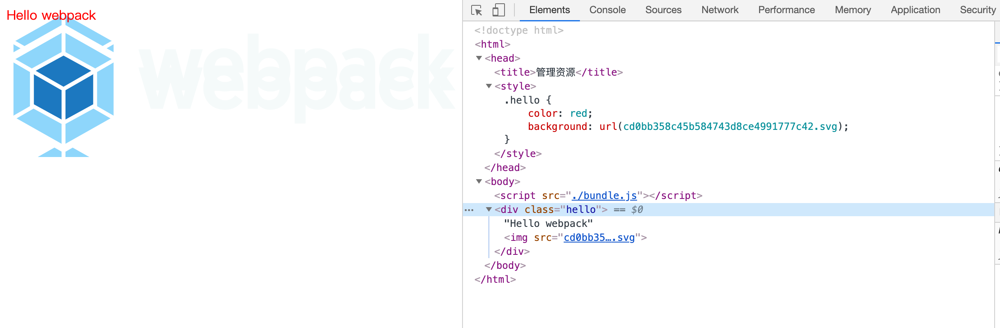
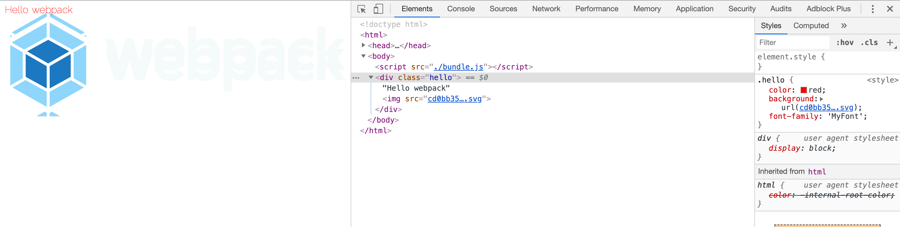

<div style="text-align:center;">
    <h1>webpack使用指南</h1>
    
</div>

***本项目是本人跟随webpack官网指南章节篇创建，旨在理解webpack各工具的使用方法的过程中，能更容易深入到其他更深层次的文章中。***

### 安装
#### 本地安装
要安装最新版本或特定版本，请运行以下命令之一：
```sh
npm install --save-dev webpack
npm install --save-dev webpack<@version>
```
如果使用 webpack 4+ 版本，还需要安装 CLI。
```sh
npm install --save-dev webpack-cli
```
> 这里先留一个疑问，为什么需要安装CLI?

对于大多数项目，建议本地安装。这可以使webpack在引入破坏式变更(breaking change)的依赖时，更容易分别升级项目。

### 起步

#### 基本安装

项目初始化，在项目路径下执行
```sh
npm init -y
npm install --save-dev webpack webpack-cli
```

此时，项目目录结构，文件内容如下：

project

```diff
	./fellow_guanwang/
	├── README.md
+ ├── index.html
+ ├── package-lock.json
+ ├── package.json
+ ├── src
+ │   └── index.js
+ └── static
+    └── imgs
```

src/index.js

```js
function component() {
    var element = document.createElement('div');
  
    // Lodash（目前通过一个 script 脚本引入）对于执行这一行是必需的
    element.innerHTML = _.join(['Hello', 'webpack'], ' ');
  
    return element;
}
  
document.body.appendChild(component());
```

Index.html

```html
<!doctype html>
<html>
  <head>
    <title>起步</title>
    <script src="https://unpkg.com/lodash@4.16.6"></script>
  </head>
  <body>
    <script src="./src/index.js"></script>
  </body>
</html>
```

我们还需要调整 `package.json` 文件，以便确保我们安装包是`私有的(private)`，并且移除 `main` 入口。这可以防止意外发布你的代码。

> *如果你想要了解* `package.json` *内在机制的更多信息，我们推荐阅读* [npm 文档](https://docs.npmjs.com/files/package.json)*。*

package.json

```diff
{
  "name": "fellow_guanwang",
  "version": "1.0.0",
  "description": "",
- "main": "index.js",
+ "private": true,
  "scripts": {
    "test": "echo \"Error: no test specified\" && exit 1"
  },
  "keywords": [],
  "author": "",
  "license": "ISC",
  "devDependencies": {
    "webpack": "^4.41.5",
    "webpack-cli": "^3.3.10"
  }
}
```

在此示例中，`<script>` 标签之间存在隐式依赖关系。`index.js `文件执行之前，还依赖于页面中引入的 `lodash`。之所以说是隐式的是因为 `index.js` 并未显式声明需要引入`lodash`，只是假定推测已经存在一个全局变量 `_`。

使用这种方式去管理 JavaScript 项目会有一些问题：

- 无法立即体现，脚本的执行依赖于外部扩展库(external library)。
- 如果依赖不存在，或者引入顺序错误，应用程序将无法正常运行。
- 如果依赖被引入但是并没有使用，浏览器将被迫下载无用代码。

让我们使用 webpack 来管理这些脚本。

#### 创建一个bundle文件

首先，需要调整下目录结构，将“源”代码(`/src`)从我们的“分发”代码(`/dist`)中分离出来。“源”代码是用于书写和编辑的代码。“分发”代码是构建过程产生的代码最小化和优化后的“输出”目录，最终将在浏览器中加载：

project:

```diff
  ./fellow_guanwang/
  ├── README.md
- ├── index.html
+ ├── dist
+ │   └── index.html
  ├── package-lock.json
  ├── package.json
  ├── src
  │   └── index.js
  └── static
      └── imgs
```

要在 `index.js` 中打包 `lodash` 依赖，我们需要在本地安装 library：

```sh
npm install --save loadsh
```

> *在安装一个要打包到生产环境的安装包时，你应该使用* `npm install --save`*，如果你在安装一个用于开发环境的安装包（例如，linter, 测试库等），你应该使用* `npm install --save-dev`*。请在* [npm 文档](https://docs.npmjs.com/cli/install) *中查找更多信息。*

现在，在我们的脚本中 import `lodash`：

src/index.js

```diff
+ import _ from 'loadsh';
+
  function component() {
     var element = document.createElement('div');
   
-    // Lodash（目前通过一个 script 脚本引入）对于执行这一行是必需的
+    // Loadsh 现在通过import导入
     element.innerHTML = _.join(['Hello', 'webpack'], ' ');
   
     return element;
   }
  
	 document.body.appendChild(component());

```

现在，由于通过打包来合成脚本，我们必须更新 `index.html` 文件。因为现在是通过 `import` 引入 lodash，所以将 lodash `` 删除，然后修改另一个 `` 标签来加载 bundle，而不是原始的 `/src` 文件：

dist/index.html

```diff
	<!doctype html>
  <html>
   <head>
     <title>起步</title>
-    <script src="https://unpkg.com/lodash@4.16.6"></script>
   </head>
   <body>
-    <script src="../src/index.js"></script>
+    <script src="./main.js"></script>
   </body>
  </html>

```

在这个设置中，`index.js` 显式要求引入的 `lodash` 必须存在，然后将它绑定为 `_`（没有全局作用域污染）。

通过声明模块所需的依赖，webpack 能够利用这些信息去构建依赖图，然后使用图生成一个优化过的，会以正确顺序执行的 bundle。

可以这样说，执行 `npx webpack`，会将我们的脚本作为[入口起点](https://www.webpackjs.com/concepts/entry-points)，然后 [输出](https://www.webpackjs.com/concepts/output) 为 `main.js`。Node 8.2+ 版本提供的 `npx` 命令，可以运行在初始安装的 webpack 包(package)的 webpack 二进制文件（`./node_modules/.bin/webpack`）：

```sh
npx -webpack

Hash: 3578d217ee0ed84bacaa
Version: webpack 4.41.5
Time: 2747ms
Built at: 2020-02-07 23:50:05
  Asset    Size  Chunks             Chunk Names
main.js  72 KiB       0  [emitted]  main
Entrypoint main = main.js
[1] ./src/index.js 265 bytes {0} [built]
[2] (webpack)/buildin/global.js 472 bytes {0} [built]
[3] (webpack)/buildin/module.js 497 bytes {0} [built]
    + 1 hidden module

WARNING in configuration
The 'mode' option has not been set, webpack will fallback to 'production' for this value. Set 'mode' option to 'development' or 'production' to enable defaults 
for each environment.
You can also set it to 'none' to disable any default behavior. Learn more: https://webpack.js.org/configuration/mode/
```

构建好后project：

```diff
    ./fellow_guanwang/
  ├── [6.9K]  README.md
  ├── dist
  │   ├── [ 132]  index.html
+ │   └── [ 72K]  main.js
  ├── [140K]  package-lock.json
  ├── [ 356]  package.json
  ├── src
  │   └── [ 265]  index.js
  └── static
      └── [  96]  imgs
```

> *输出可能会稍有不同，但是只要构建成功，那么你就可以继续。并且不要担心，稍后我们就会解决。*

在浏览器中打开 `index.html`，如果一切访问都正常，你应该能看到以下文本：'Hello webpack'。

> 可以看到打包后的文件居然达到了72k，体积明显大了很多，这也是使用打包的缺点。

#### 模块

[ES2015](https://babeljs.io/learn-es2015/) 中的 [`import`](https://developer.mozilla.org/en-US/docs/Web/JavaScript/Reference/Statements/import) 和 [`export`](https://developer.mozilla.org/en-US/docs/Web/JavaScript/Reference/Statements/export) 语句已经被标准化。虽然大多数浏览器还无法支持它们，但是 webpack 却能够提供开箱即用般的支持。

事实上，webpack 在幕后会将代码“转译”，以便旧版本浏览器可以执行。如果你检查 `dist/bundle.js`，你可以看到 webpack 具体如何实现，这是独创精巧的设计！除了 `import` 和 `export`，webpack 还能够很好地支持多种其他模块语法，更多信息请查看[模块 API](https://www.webpackjs.com/api/module-methods)。

注意，webpack 不会更改代码中除 `import` 和 `export` 语句以外的部分。如果你在使用其它 [ES2015 特性](http://es6-features.org/)，请确保你在 webpack 的 [loader 系统](https://www.webpackjs.com/concepts/loaders/)中使用了一个像是 [Babel](https://babeljs.io/) 或 [Bublé](https://buble.surge.sh/guide/) 的[转译器](https://www.webpackjs.com/loaders/#transpiling)。

#### 使用一个配置文件

在 webpack 4 中，可以无须任何配置使用，然而大多数项目会需要很复杂的设置，这就是为什么 webpack 仍然要支持 [配置文件](https://www.webpackjs.com/concepts/configuration)。这比在终端(terminal)中手动输入大量命令要高效的多，所以让我们创建一个取代以上使用 CLI 选项方式的配置文件：

**project**

```diff
  ./fellow_guanwang/
  ├── README.md
  ├── dist
  │   ├── index.html
  │   └── main.js
  ├── package-lock.json
  ├── package.json
  ├── src
  │   └── index.js
  ├── static
  │   └── imgs
+ └── webpack.config.js
```

**webpack.config.js**

```js
const path = require('path');

module.exports = {
    entry: "./src/index.js",
    output: {
        filename: 'bundle.js',
        path: path.resolve(__dirname, 'dist')
    }
}
```

现在，让我们通过新配置文件再次执行构建

```shell
npx webpack --config webpack.config.js

Hash: 3578d217ee0ed84bacaa
Version: webpack 4.41.5
Time: 378ms
Built at: 2020-02-08 00:16:55
  Asset    Size  Chunks             Chunk Names
main.js  72 KiB       0  [emitted]  main
Entrypoint main = main.js
[1] ./src/index.js 265 bytes {0} [built]
[2] (webpack)/buildin/global.js 472 bytes {0} [built]
[3] (webpack)/buildin/module.js 497 bytes {0} [built]
    + 1 hidden module

WARNING in configuration
The 'mode' option has not been set, webpack will fallback to 'production' for this value. Set 'mode' option to 'development' or 'production' to enable defaults 
for each environment.
You can also set it to 'none' to disable any default behavior. Learn more: https://webpack.js.org/configuration/mode/
```

> ***为什么构建出来是main.js而不是bundle.js？后来排查到时将配置文件中的export写错了，导致配置文件失效，任然用的默认打包方式。***

**修改完后重新执行**

```sh
npx webpack --config webpack.config.js

Hash: 1d32ddb2222f6868fc98
Version: webpack 4.41.5
Time: 359ms
Built at: 2020-02-08 00:25:40
    Asset    Size  Chunks             Chunk Names
bundle.js  72 KiB       0  [emitted]  main
Entrypoint main = bundle.js
[1] ./src/index.js 265 bytes {0} [built]
[2] (webpack)/buildin/global.js 472 bytes {0} [built]
[3] (webpack)/buildin/module.js 497 bytes {0} [built]
    + 1 hidden module

WARNING in configuration
The 'mode' option has not been set, webpack will fallback to 'production' for this value. Set 'mode' option to 'development' or 'production' to enable defaults for each environment.
You can also set it to 'none' to disable any default behavior. Learn more: https://webpack.js.org/configuration/mode/
```

> *注意，当在 windows 中通过调用路径去调用* `webpack` *时，必须使用反斜线()。例如* `node_modules\.bin\webpack --config webpack.config.js`*。*

> *如果* `webpack.config.js` *存在，则* `webpack` *命令将默认选择使用它。我们在这里使用* `--config` *选项只是向你表明，可以传递任何名称的配置文件。这对于需要拆分成多个文件的复杂配置是非常有用。*

比起 CLI 这种简单直接的使用方式，配置文件具有更多的灵活性。我们可以通过配置方式指定 loader 规则(loader rules)、插件(plugins)、解析选项(resolve options)，以及许多其他增强功能。了解更多详细信息，请查看[配置文档](https://www.webpackjs.com/configuration)。

#### NPM脚本(NPM Scripts)

考虑到用 CLI 这种方式来运行本地的 webpack 不是特别方便，我们可以设置一个快捷方式。在 *package.json* 添加一个 [npm 脚本(npm script)](https://docs.npmjs.com/misc/scripts)：

**package.json**

```diff
  {
    "name": "fellow_guanwang",
    "version": "1.0.0",
    "description": "",
    "private": true,
    "scripts": {
      "test": "echo \"Error: no test specified\" && exit 1",
+     "build": "webpack --config webpack.config.js"
    },
    "keywords": [],
    "author": "",
    "license": "ISC",
    "devDependencies": {
      "webpack": "^4.41.5",
      "webpack-cli": "^3.3.10"
    },
    "dependencies": {
      "loadsh": "0.0.4"
    }
}
```

现在，可以使用 `npm run build` 命令，来替代我们之前使用的 `npx` 命令。注意，使用 npm 的 `scripts`，我们可以像使用 `npx` 那样通过模块名引用本地安装的 npm 包。这是大多数基于 npm 的项目遵循的标准，因为它允许所有贡献者使用同一组通用脚本（如果必要，每个 flag 都带有 `--config` 标志）。

现在运行以下命令，然后看看你的脚本别名是否正常运行：

```
npm run build

Hash: 1d32ddb2222f6868fc98
Version: webpack 4.41.5
Time: 398ms
Built at: 2020-02-08 00:35:40
    Asset    Size  Chunks             Chunk Names
bundle.js  72 KiB       0  [emitted]  main
Entrypoint main = bundle.js
[1] ./src/index.js 265 bytes {0} [built]
[2] (webpack)/buildin/global.js 472 bytes {0} [built]
[3] (webpack)/buildin/module.js 497 bytes {0} [built]
    + 1 hidden module

WARNING in configuration
The 'mode' option has not been set, webpack will fallback to 'production' for this value. Set 'mode' option to 'development' or 'production' to enable defaults for each environment.
You can also set it to 'none' to disable any default behavior. Learn more: https://webpack.js.org/configuration/mode/
```

> *通过向* `npm run build` *命令和你的参数之间添加两个中横线，可以将自定义参数传递给 webpack，例如：*`npm run build -- --colors`*。*

### 管理资源

在 webpack 出现之前，前端开发人员会使用 grunt 和 gulp 等工具来处理资源，并将它们从 `/src` 文件夹移动到 `/dist` 或 `/build` 目录中。同样方式也被用于 JavaScript 模块，但是，像 webpack 这样的工具，将**动态打包(dynamically bundle)**所有依赖项（创建所谓的[依赖图(dependency graph)](https://www.webpackjs.com/concepts/dependency-graph)）。这是极好的创举，因为现在每个模块都可以*明确表述它自身的依赖*，我们将避免打包未使用的模块。

webpack 最出色的功能之一就是，除了 JavaScript，还可以通过 loader *引入任何其他类型的文件*。也就是说，以上列出的那些 JavaScript 的优点（例如显式依赖），同样可以用来构建网站或 web 应用程序中的所有非 JavaScript 内容。

开始之前，先对项目做一个小小的修改:

**dist/index.html**

```diff
  <!doctype html>
  <html>
    <head>
-    <title>起步</title>
+    <title>管理资源</title>
    </head>
    <body>
      <script src="./main.js"></script>
    </body>
  </html>
```

#### 加载css

为了从 JavaScript 模块中 `import` 一个 CSS 文件，你需要在 [`module` 配置中](https://www.webpackjs.com/configuration/module) 安装并添加 [style-loader](https://www.webpackjs.com/loaders/style-loader) 和 [css-loader](https://www.webpackjs.com/loaders/css-loader)：

```sh
npm install --save-dev style-loader css-loader
```

**webpack.config.js**

```diff
  const path = require('path');

  module.exports = {
      entry: "./src/index.js",
      output: {
          filename: 'bundle.js',
          path: path.resolve(__dirname, 'dist')
      },
+     module: {
+         rules: [
+             {
+                 test: /\.css$/,
+                 use: [
+                     'style-loader',
+                     'css-loader'
+                 ]
+             }
+         ]
+     }
  }
```

> *webpack 根据正则表达式，来确定应该查找哪些文件，并将其提供给指定的 loader。在这种情况下，以* `.css` *结尾的全部文件，都将被提供给* `style-loader` *和* `css-loader`*。*

这使你可以在依赖于此样式的文件中 `import './style.css'`。现在，当该模块运行时，含有 CSS 字符串的 `` 标签，将被插入到 html 文件的 `` 中。

我们尝试一下，通过在项目中添加一个新的 `style.css` 文件，并将其导入到我们的 `index.js` 中：

**project**

```diff
  ./fellow_guanwang/
  ├── README.md
  ├── dist
  │   ├── bundle.js
  │   ├── index.html
  │   └── main.js
  ├── package-lock.json
  ├── package.json
  ├── src
  │   ├── index.js
+ │   └── style.css
  ├── static
  │   └── imgs
  └── webpack.config.js
```

**src/style.css**

```css
.hello {
    color: red;
}
```

**src/index.js**

```diff
  import _ from 'loadsh';
+ import './style.css';
 
  function component() {
      var element = document.createElement('div');
   
      // Loadsh 现在通过import导入
      element.innerHTML = _.join(['Hello', 'webpack'], ' ');
+     element.classList.add('hello');

      return element;
  }
```

现在运行构建命令：

```sh
npm run build

Hash: 294df95764363b55663d
Version: webpack 4.41.5
Time: 3047ms
Built at: 2020-02-08 01:35:53
    Asset      Size  Chunks             Chunk Names
bundle.js  75.7 KiB       0  [emitted]  main
Entrypoint main = bundle.js
[1] ./src/index.js 321 bytes {0} [built]
[2] (webpack)/buildin/global.js 472 bytes {0} [built]
[3] (webpack)/buildin/module.js 497 bytes {0} [built]
[4] ./src/style.css 561 bytes {0} [built]
[6] ./node_modules/css-loader/dist/cjs.js!./src/style.css 260 bytes {0} [built]
    + 3 hidden modules

WARNING in configuration
The 'mode' option has not been set, webpack will fallback to 'production' for this value. Set 'mode' option to 'development' or 'production' to enable defaults for each environment.
You can also set it to 'none' to disable any default behavior. Learn more: https://webpack.js.org/configuration/mode/
```

再次在浏览器中打开 `index.html`，你应该看到 `Hello webpack` 现在的样式是红色。要查看 webpack 做了什么，请检查页面（不要查看页面源代码，因为它不会显示结果），并查看页面的 head 标签。它应该包含我们在 `index.js` 中导入的 style 块元素。

> *请注意，在多数情况下，你也可以进行* [CSS 分离](https://www.webpackjs.com/plugins/extract-text-webpack-plugin)*，以便在生产环境中节省加载时间。最重要的是，现有的 loader 可以支持任何你可以想到的 CSS 处理器风格 -* [postcss](https://www.webpackjs.com/loaders/postcss-loader)*,* [sass](https://www.webpackjs.com/loaders/sass-loader) *和* [less](https://www.webpackjs.com/loaders/less-loader) *等。*

#### 加载图片

假想，现在我们正在下载 CSS，但是我们的背景和图标这些图片，要如何处理呢？使用 [file-loader](https://www.webpackjs.com/loaders/file-loader)，我们可以轻松地将这些内容混合到 CSS 中：

```sh
npm install --save-dev file-loader
```

**webpack.config.js**

```diff
  const path = require('path');

  module.exports = {
      entry: "./src/index.js",
      output: {
          filename: 'bundle.js',
          path: path.resolve(__dirname, 'dist')
      },
      module: {
          rules: [
              {
                  test: /\.css$/,
                  use: [
                      'style-loader',
                      'css-loader'
                  ]
              },
+             {
+                 test: /\.(png|svg|jpg|gif)$/,
+                 use: [
+                     'file-loader'
+                 ]
+             }
          ]
      }
  }
```

现在，当你 `import MyImage from './my-image.png'`，该图像将被处理并添加到 `output` 目录，_并且_ `MyImage` 变量将包含该图像在处理后的最终 url。当使用 [css-loader](https://www.webpackjs.com/loaders/css-loader) 时，如上所示，你的 CSS 中的 `url('./my-image.png')` 会使用类似的过程去处理。loader 会识别这是一个本地文件，并将 `'./my-image.png'` 路径，替换为`输出`目录中图像的最终路径。[html-loader](https://www.webpackjs.com/loaders/html-loader) 以相同的方式处理 ``。

我们向项目添加一个图像，然后看它是如何工作的，你可以使用任何你喜欢的图像：

**project**

```diff
  ./fellow_guanwang/
  ├── README.md
  ├── dist
  │   ├── bundle.js
  │   ├── index.html
  │   └── main.js
  ├── package-lock.json
  ├── package.json
  ├── src
+ │   ├── Icon.svg
  │   ├── index.js
  │   └── style.css
  ├── static
  │   └── imgs
  └── webpack.config.js
```

**src/index.js**

```diff
   import _ from 'loadsh';
   import './style.css';
+  import Icon from './Icon.svg'

   function component() {
       var element = document.createElement('div');

       // Loadsh 现在通过import导入
       element.innerHTML = _.join(['Hello', 'webpack'], ' ');
       element.classList.add('hello');

+      //添加图片到div
+      var myIcon = new Image();
+      myIcon.src = Icon;
+      element.appendChild(myIcon);

       return element;
   }

   document.body.appendChild(component());
```

**rc/style.css**

```diff
   .hello {
       color: red;
+      background: url(./Icon.svg);
   }
```

让我们重新构建，并再次打开 index.html 文件：

```shell
npm run build

Hash: 3da5d0a541b0de8fd581
Version: webpack 4.41.5
Time: 635ms
Built at: 2020-02-08 10:46:48
                               Asset      Size  Chunks             Chunk Names
                           bundle.js  76.2 KiB       0  [emitted]  main
cd0bb358c45b584743d8ce4991777c42.svg  2.33 KiB          [emitted]  
Entrypoint main = bundle.js
[0] ./src/Icon.svg 80 bytes {0} [built]
[2] ./src/index.js 467 bytes {0} [built]
[3] (webpack)/buildin/global.js 472 bytes {0} [built]
[4] (webpack)/buildin/module.js 497 bytes {0} [built]
[5] ./src/style.css 561 bytes {0} [built]
[7] ./node_modules/css-loader/dist/cjs.js!./src/style.css 590 bytes {0} [built]
    + 4 hidden modules

WARNING in configuration
The 'mode' option has not been set, webpack will fallback to 'production' for this value. Set 'mode' option to 'development' or 'production' to enable defaults for each environment.
You can also set it to 'none' to disable any default behavior. Learn more: https://webpack.js.org/configuration/mode/
```

如果一切顺利，和 `Hello webpack` 文本旁边的 `img` 元素一样，现在看到的图标是重复的背景图片。如果你检查此元素，你将看到实际的文件名已更改为像 `cd0bb358c45b584743d8ce4991777c42.svg` 一样。这意味着 webpack 在 `src` 文件夹中找到我们的文件，并成功处理过它！

直接查看浏览器可以更直观地理解上面👆地话：



> *合乎逻辑下一步是，压缩和优化你的图像。查看* [image-webpack-loader](https://github.com/tcoopman/image-webpack-loader) *和* [url-loader](https://www.webpackjs.com/loaders/url-loader)*，以了解更多关于如果增强加载处理图片功能*

#### 加载字体

那么，像字体这样的其他资源如何处理呢？file-loader 和 url-loader 可以接收并加载任何文件，然后将其输出到构建目录。这就是说，我们可以将它们用于任何类型的文件，包括字体。让我们更新 `webpack.config.js` 来处理字体文件：

**webpack.config.js**

```diff
const path = require('path');

module.exports = {
    entry: "./src/index.js",
    output: {
        filename: 'bundle.js',
        path: path.resolve(__dirname, 'dist')
    },
    module: {
        rules: [
            {
                test: /\.css$/,
                use: [
                    'style-loader',
                    'css-loader'
                ]
            },
            {
                test: /\.(png|svg|jpg|gif)$/,
                use: [
                    'file-loader'
                ]
            },
+           {
+               test: /\.(woff|woff2|eot|ttf|otf)$/,
+               use: [
+                   'file-loader'
+               ]
+           }
        ]
    }
}
```

在项目中添加一些字体文件：

**project**

```diff
  ./fellow_guanwang/
  ├── README.md
  ├── dist
  │   ├── bundle.js
  │   ├── cd0bb358c45b584743d8ce4991777c42.svg
  │   ├── index.html
  │   └── main.js
  ├── package-lock.json
  ├── package.json
  ├── src
  │   ├── Icon.svg
+ │   ├── raleway_thin.ttf
  │   ├── index.js
  │   └── style.css
  ├── static
  │   └── imgs
  └── webpack.config.js
```

通过配置好 loader 并将字体文件放在合适的地方，你可以通过一个 `@font-face` 声明引入。本地的 `url(...)` 指令会被 webpack 获取处理，就像它处理图片资源一样：

**src/style.css**

```diff
+  @font-face {
+      font-family: 'MyFont';
+      src:  url(./raleway_thin.ttf);
+      font-weight: 600;
+      font-style: normal;
+  }
+
   .hello {
       color: red;
       background: url(./Icon.svg);
+      font-family: 'MyFont';
   }
```

现在让我们重新构建来看看 webpack 是否处理了我们的字体：

```shell
npm run build

Hash: 5bf07e40983fbe94dab6
Version: webpack 4.41.5
Time: 2871ms
Built at: 2020-02-08 11:24:02
                               Asset      Size  Chunks             Chunk Names
                           bundle.js  76.5 KiB       0  [emitted]  main
cd0bb358c45b584743d8ce4991777c42.svg  2.33 KiB          [emitted]  
ee2d5b0472964762a3bc2b6066e51f81.ttf  70.6 KiB          [emitted]  
Entrypoint main = bundle.js
 [0] ./src/Icon.svg 80 bytes {0} [built]
 [2] ./src/index.js 467 bytes {0} [built]
 [3] (webpack)/buildin/global.js 472 bytes {0} [built]
 [4] (webpack)/buildin/module.js 497 bytes {0} [built]
 [5] ./src/style.css 561 bytes {0} [built]
 [7] ./node_modules/css-loader/dist/cjs.js!./src/style.css 945 bytes {0} [built]
[10] ./src/raleway_thin.ttf 80 bytes {0} [built]
    + 4 hidden modules
    
WARNING in configuration
The 'mode' option has not been set, webpack will fallback to 'production' for this value. Set 'mode' option to 'development' or 'production' to enable defaults for each environment.
You can also set it to 'none' to disable any default behavior. Learn more: https://webpack.js.org/configuration/mode/
```

重新打开 `index.html` 看看我们的 `Hello webpack` 文本显示是否换上了新的字体。如果一切顺利，你应该能看到变化。



