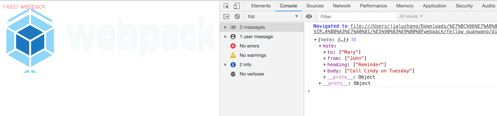
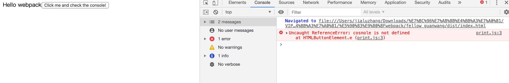
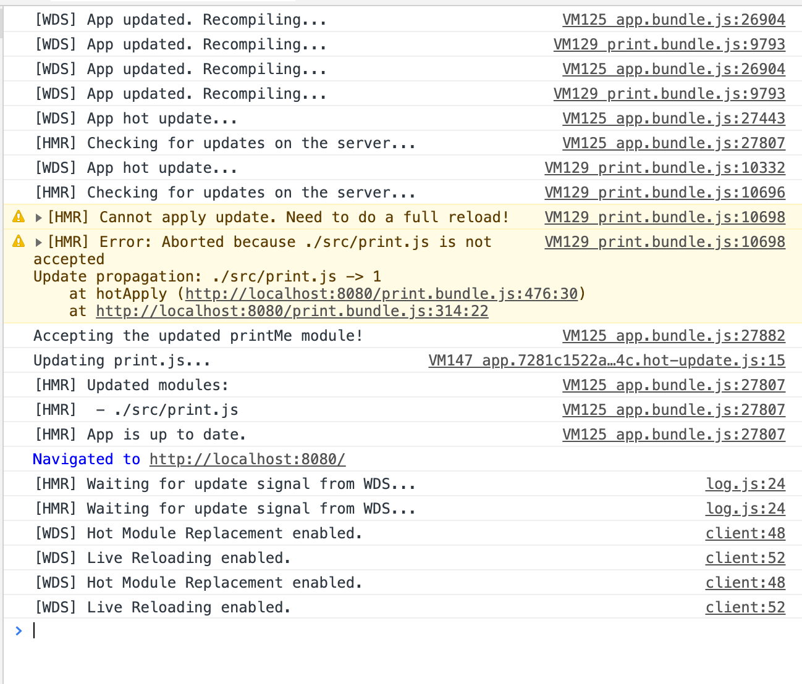

<div style="text-align:center;">
    <h1>webpack使用指南</h1>
    
</div>

***本项目是本人跟随webpack官网指南章节篇创建，旨在理解webpack各工具的使用方法的过程中，能更容易深入到其他更深层次的文章中。***

### 安装
#### 本地安装
要安装最新版本或特定版本，请运行以下命令之一：
```sh
npm install --save-dev webpack
npm install --save-dev webpack<@version>
```
如果使用 webpack 4+ 版本，还需要安装 CLI。
```sh
npm install --save-dev webpack-cli
```
> 这里先留一个疑问，为什么需要安装CLI?

对于大多数项目，建议本地安装。这可以使webpack在引入破坏式变更(breaking change)的依赖时，更容易分别升级项目。

### 起步

#### 基本安装

项目初始化，在项目路径下执行
```sh
npm init -y
npm install --save-dev webpack webpack-cli
```

此时，项目目录结构，文件内容如下：

project

```diff
	./fellow_guanwang/
	├── README.md
+ ├── index.html
+ ├── package-lock.json
+ ├── package.json
+ ├── src
+ │   └── index.js
+ └── static
+    └── imgs
```

src/index.js

```js
function component() {
    var element = document.createElement('div');
  
    // Lodash（目前通过一个 script 脚本引入）对于执行这一行是必需的
    element.innerHTML = _.join(['Hello', 'webpack'], ' ');
  
    return element;
}
  
document.body.appendChild(component());
```

Index.html

```html
<!doctype html>
<html>
  <head>
    <title>起步</title>
    <script src="https://unpkg.com/lodash@4.16.6"></script>
  </head>
  <body>
    <script src="./src/index.js"></script>
  </body>
</html>
```

我们还需要调整 `package.json` 文件，以便确保我们安装包是`私有的(private)`，并且移除 `main` 入口。这可以防止意外发布你的代码。

> *如果你想要了解* `package.json` *内在机制的更多信息，我们推荐阅读* [npm 文档](https://docs.npmjs.com/files/package.json)*。*

package.json

```diff
{
  "name": "fellow_guanwang",
  "version": "1.0.0",
  "description": "",
- "main": "index.js",
+ "private": true,
  "scripts": {
    "test": "echo \"Error: no test specified\" && exit 1"
  },
  "keywords": [],
  "author": "",
  "license": "ISC",
  "devDependencies": {
    "webpack": "^4.41.5",
    "webpack-cli": "^3.3.10"
  }
}
```

在此示例中，`<script>` 标签之间存在隐式依赖关系。`index.js `文件执行之前，还依赖于页面中引入的 `lodash`。之所以说是隐式的是因为 `index.js` 并未显式声明需要引入`lodash`，只是假定推测已经存在一个全局变量 `_`。

使用这种方式去管理 JavaScript 项目会有一些问题：

- 无法立即体现，脚本的执行依赖于外部扩展库(external library)。
- 如果依赖不存在，或者引入顺序错误，应用程序将无法正常运行。
- 如果依赖被引入但是并没有使用，浏览器将被迫下载无用代码。

让我们使用 webpack 来管理这些脚本。

#### 创建一个bundle文件

首先，需要调整下目录结构，将“源”代码(`/src`)从我们的“分发”代码(`/dist`)中分离出来。“源”代码是用于书写和编辑的代码。“分发”代码是构建过程产生的代码最小化和优化后的“输出”目录，最终将在浏览器中加载：

project:

```diff
  ./fellow_guanwang/
  ├── README.md
- ├── index.html
+ ├── dist
+ │   └── index.html
  ├── package-lock.json
  ├── package.json
  ├── src
  │   └── index.js
  └── static
      └── imgs
```

要在 `index.js` 中打包 `lodash` 依赖，我们需要在本地安装 library：

```sh
npm install --save loadsh
```

> *在安装一个要打包到生产环境的安装包时，你应该使用* `npm install --save`*，如果你在安装一个用于开发环境的安装包（例如，linter, 测试库等），你应该使用* `npm install --save-dev`*。请在* [npm 文档](https://docs.npmjs.com/cli/install) *中查找更多信息。*

现在，在我们的脚本中 import `lodash`：

src/index.js

```diff
+ import _ from 'loadsh';
+
  function component() {
     var element = document.createElement('div');
   
-    // Lodash（目前通过一个 script 脚本引入）对于执行这一行是必需的
+    // Loadsh 现在通过import导入
     element.innerHTML = _.join(['Hello', 'webpack'], ' ');
   
     return element;
   }
  
	 document.body.appendChild(component());

```

现在，由于通过打包来合成脚本，我们必须更新 `index.html` 文件。因为现在是通过 `import` 引入 lodash，所以将 lodash `` 删除，然后修改另一个 `` 标签来加载 bundle，而不是原始的 `/src` 文件：

dist/index.html

```diff
	<!doctype html>
  <html>
   <head>
     <title>起步</title>
-    <script src="https://unpkg.com/lodash@4.16.6"></script>
   </head>
   <body>
-    <script src="../src/index.js"></script>
+    <script src="./main.js"></script>
   </body>
  </html>

```

在这个设置中，`index.js` 显式要求引入的 `lodash` 必须存在，然后将它绑定为 `_`（没有全局作用域污染）。

通过声明模块所需的依赖，webpack 能够利用这些信息去构建依赖图，然后使用图生成一个优化过的，会以正确顺序执行的 bundle。

可以这样说，执行 `npx webpack`，会将我们的脚本作为[入口起点](https://www.webpackjs.com/concepts/entry-points)，然后 [输出](https://www.webpackjs.com/concepts/output) 为 `main.js`。Node 8.2+ 版本提供的 `npx` 命令，可以运行在初始安装的 webpack 包(package)的 webpack 二进制文件（`./node_modules/.bin/webpack`）：

```sh
npx -webpack

Hash: 3578d217ee0ed84bacaa
Version: webpack 4.41.5
Time: 2747ms
Built at: 2020-02-07 23:50:05
  Asset    Size  Chunks             Chunk Names
main.js  72 KiB       0  [emitted]  main
Entrypoint main = main.js
[1] ./src/index.js 265 bytes {0} [built]
[2] (webpack)/buildin/global.js 472 bytes {0} [built]
[3] (webpack)/buildin/module.js 497 bytes {0} [built]
    + 1 hidden module

WARNING in configuration
The 'mode' option has not been set, webpack will fallback to 'production' for this value. Set 'mode' option to 'development' or 'production' to enable defaults 
for each environment.
You can also set it to 'none' to disable any default behavior. Learn more: https://webpack.js.org/configuration/mode/
```

构建好后project：

```diff
    ./fellow_guanwang/
  ├── [6.9K]  README.md
  ├── dist
  │   ├── [ 132]  index.html
+ │   └── [ 72K]  main.js
  ├── [140K]  package-lock.json
  ├── [ 356]  package.json
  ├── src
  │   └── [ 265]  index.js
  └── static
      └── [  96]  imgs
```

> *输出可能会稍有不同，但是只要构建成功，那么你就可以继续。并且不要担心，稍后我们就会解决。*

在浏览器中打开 `index.html`，如果一切访问都正常，你应该能看到以下文本：'Hello webpack'。

> 可以看到打包后的文件居然达到了72k，体积明显大了很多，这也是使用打包的缺点。

#### 模块

[ES2015](https://babeljs.io/learn-es2015/) 中的 [`import`](https://developer.mozilla.org/en-US/docs/Web/JavaScript/Reference/Statements/import) 和 [`export`](https://developer.mozilla.org/en-US/docs/Web/JavaScript/Reference/Statements/export) 语句已经被标准化。虽然大多数浏览器还无法支持它们，但是 webpack 却能够提供开箱即用般的支持。

事实上，webpack 在幕后会将代码“转译”，以便旧版本浏览器可以执行。如果你检查 `dist/bundle.js`，你可以看到 webpack 具体如何实现，这是独创精巧的设计！除了 `import` 和 `export`，webpack 还能够很好地支持多种其他模块语法，更多信息请查看[模块 API](https://www.webpackjs.com/api/module-methods)。

注意，webpack 不会更改代码中除 `import` 和 `export` 语句以外的部分。如果你在使用其它 [ES2015 特性](http://es6-features.org/)，请确保你在 webpack 的 [loader 系统](https://www.webpackjs.com/concepts/loaders/)中使用了一个像是 [Babel](https://babeljs.io/) 或 [Bublé](https://buble.surge.sh/guide/) 的[转译器](https://www.webpackjs.com/loaders/#transpiling)。

#### 使用一个配置文件

在 webpack 4 中，可以无须任何配置使用，然而大多数项目会需要很复杂的设置，这就是为什么 webpack 仍然要支持 [配置文件](https://www.webpackjs.com/concepts/configuration)。这比在终端(terminal)中手动输入大量命令要高效的多，所以让我们创建一个取代以上使用 CLI 选项方式的配置文件：

**project**

```diff
  ./fellow_guanwang/
  ├── README.md
  ├── dist
  │   ├── index.html
  │   └── main.js
  ├── package-lock.json
  ├── package.json
  ├── src
  │   └── index.js
  ├── static
  │   └── imgs
+ └── webpack.config.js
```

**webpack.config.js**

```js
const path = require('path');

module.exports = {
    entry: "./src/index.js",
    output: {
        filename: 'bundle.js',
        path: path.resolve(__dirname, 'dist')
    }
}
```

现在，让我们通过新配置文件再次执行构建

```shell
npx webpack --config webpack.config.js

Hash: 3578d217ee0ed84bacaa
Version: webpack 4.41.5
Time: 378ms
Built at: 2020-02-08 00:16:55
  Asset    Size  Chunks             Chunk Names
main.js  72 KiB       0  [emitted]  main
Entrypoint main = main.js
[1] ./src/index.js 265 bytes {0} [built]
[2] (webpack)/buildin/global.js 472 bytes {0} [built]
[3] (webpack)/buildin/module.js 497 bytes {0} [built]
    + 1 hidden module

WARNING in configuration
The 'mode' option has not been set, webpack will fallback to 'production' for this value. Set 'mode' option to 'development' or 'production' to enable defaults 
for each environment.
You can also set it to 'none' to disable any default behavior. Learn more: https://webpack.js.org/configuration/mode/
```

> ***为什么构建出来是main.js而不是bundle.js？后来排查到时将配置文件中的export写错了，导致配置文件失效，任然用的默认打包方式。***

**修改完后重新执行**

```sh
npx webpack --config webpack.config.js

Hash: 1d32ddb2222f6868fc98
Version: webpack 4.41.5
Time: 359ms
Built at: 2020-02-08 00:25:40
    Asset    Size  Chunks             Chunk Names
bundle.js  72 KiB       0  [emitted]  main
Entrypoint main = bundle.js
[1] ./src/index.js 265 bytes {0} [built]
[2] (webpack)/buildin/global.js 472 bytes {0} [built]
[3] (webpack)/buildin/module.js 497 bytes {0} [built]
    + 1 hidden module

WARNING in configuration
The 'mode' option has not been set, webpack will fallback to 'production' for this value. Set 'mode' option to 'development' or 'production' to enable defaults for each environment.
You can also set it to 'none' to disable any default behavior. Learn more: https://webpack.js.org/configuration/mode/
```

> *注意，当在 windows 中通过调用路径去调用* `webpack` *时，必须使用反斜线()。例如* `node_modules\.bin\webpack --config webpack.config.js`*。*

> *如果* `webpack.config.js` *存在，则* `webpack` *命令将默认选择使用它。我们在这里使用* `--config` *选项只是向你表明，可以传递任何名称的配置文件。这对于需要拆分成多个文件的复杂配置是非常有用。*

比起 CLI 这种简单直接的使用方式，配置文件具有更多的灵活性。我们可以通过配置方式指定 loader 规则(loader rules)、插件(plugins)、解析选项(resolve options)，以及许多其他增强功能。了解更多详细信息，请查看[配置文档](https://www.webpackjs.com/configuration)。

#### NPM脚本(NPM Scripts)

考虑到用 CLI 这种方式来运行本地的 webpack 不是特别方便，我们可以设置一个快捷方式。在 *package.json* 添加一个 [npm 脚本(npm script)](https://docs.npmjs.com/misc/scripts)：

**package.json**

```diff
  {
    "name": "fellow_guanwang",
    "version": "1.0.0",
    "description": "",
    "private": true,
    "scripts": {
      "test": "echo \"Error: no test specified\" && exit 1",
+     "build": "webpack --config webpack.config.js"
    },
    "keywords": [],
    "author": "",
    "license": "ISC",
    "devDependencies": {
      "webpack": "^4.41.5",
      "webpack-cli": "^3.3.10"
    },
    "dependencies": {
      "loadsh": "0.0.4"
    }
}
```

现在，可以使用 `npm run build` 命令，来替代我们之前使用的 `npx` 命令。注意，使用 npm 的 `scripts`，我们可以像使用 `npx` 那样通过模块名引用本地安装的 npm 包。这是大多数基于 npm 的项目遵循的标准，因为它允许所有贡献者使用同一组通用脚本（如果必要，每个 flag 都带有 `--config` 标志）。

现在运行以下命令，然后看看你的脚本别名是否正常运行：

```
npm run build

Hash: 1d32ddb2222f6868fc98
Version: webpack 4.41.5
Time: 398ms
Built at: 2020-02-08 00:35:40
    Asset    Size  Chunks             Chunk Names
bundle.js  72 KiB       0  [emitted]  main
Entrypoint main = bundle.js
[1] ./src/index.js 265 bytes {0} [built]
[2] (webpack)/buildin/global.js 472 bytes {0} [built]
[3] (webpack)/buildin/module.js 497 bytes {0} [built]
    + 1 hidden module

WARNING in configuration
The 'mode' option has not been set, webpack will fallback to 'production' for this value. Set 'mode' option to 'development' or 'production' to enable defaults for each environment.
You can also set it to 'none' to disable any default behavior. Learn more: https://webpack.js.org/configuration/mode/
```

> *通过向* `npm run build` *命令和你的参数之间添加两个中横线，可以将自定义参数传递给 webpack，例如：*`npm run build -- --colors`*。*

### 管理资源

在 webpack 出现之前，前端开发人员会使用 grunt 和 gulp 等工具来处理资源，并将它们从 `/src` 文件夹移动到 `/dist` 或 `/build` 目录中。同样方式也被用于 JavaScript 模块，但是，像 webpack 这样的工具，将**动态打包(dynamically bundle)**所有依赖项（创建所谓的[依赖图(dependency graph)](https://www.webpackjs.com/concepts/dependency-graph)）。这是极好的创举，因为现在每个模块都可以*明确表述它自身的依赖*，我们将避免打包未使用的模块。

webpack 最出色的功能之一就是，除了 JavaScript，还可以通过 loader *引入任何其他类型的文件*。也就是说，以上列出的那些 JavaScript 的优点（例如显式依赖），同样可以用来构建网站或 web 应用程序中的所有非 JavaScript 内容。

开始之前，先对项目做一个小小的修改:

**dist/index.html**

```diff
  <!doctype html>
  <html>
    <head>
-    <title>起步</title>
+    <title>管理资源</title>
    </head>
    <body>
      <script src="./main.js"></script>
    </body>
  </html>
```

#### 加载css

为了从 JavaScript 模块中 `import` 一个 CSS 文件，你需要在 [`module` 配置中](https://www.webpackjs.com/configuration/module) 安装并添加 [style-loader](https://www.webpackjs.com/loaders/style-loader) 和 [css-loader](https://www.webpackjs.com/loaders/css-loader)：

```sh
npm install --save-dev style-loader css-loader
```

**webpack.config.js**

```diff
  const path = require('path');

  module.exports = {
      entry: "./src/index.js",
      output: {
          filename: 'bundle.js',
          path: path.resolve(__dirname, 'dist')
      },
+     module: {
+         rules: [
+             {
+                 test: /\.css$/,
+                 use: [
+                     'style-loader',
+                     'css-loader'
+                 ]
+             }
+         ]
+     }
  }
```

> *webpack 根据正则表达式，来确定应该查找哪些文件，并将其提供给指定的 loader。在这种情况下，以* `.css` *结尾的全部文件，都将被提供给* `style-loader` *和* `css-loader`*。*

这使你可以在依赖于此样式的文件中 `import './style.css'`。现在，当该模块运行时，含有 CSS 字符串的 `` 标签，将被插入到 html 文件的 `` 中。

我们尝试一下，通过在项目中添加一个新的 `style.css` 文件，并将其导入到我们的 `index.js` 中：

**project**

```diff
  ./fellow_guanwang/
  ├── README.md
  ├── dist
  │   ├── bundle.js
  │   ├── index.html
  │   └── main.js
  ├── package-lock.json
  ├── package.json
  ├── src
  │   ├── index.js
+ │   └── style.css
  ├── static
  │   └── imgs
  └── webpack.config.js
```

**src/style.css**

```css
.hello {
    color: red;
}
```

**src/index.js**

```diff
  import _ from 'loadsh';
+ import './style.css';
 
  function component() {
      var element = document.createElement('div');
   
      // Loadsh 现在通过import导入
      element.innerHTML = _.join(['Hello', 'webpack'], ' ');
+     element.classList.add('hello');

      return element;
  }
```

现在运行构建命令：

```sh
npm run build

Hash: 294df95764363b55663d
Version: webpack 4.41.5
Time: 3047ms
Built at: 2020-02-08 01:35:53
    Asset      Size  Chunks             Chunk Names
bundle.js  75.7 KiB       0  [emitted]  main
Entrypoint main = bundle.js
[1] ./src/index.js 321 bytes {0} [built]
[2] (webpack)/buildin/global.js 472 bytes {0} [built]
[3] (webpack)/buildin/module.js 497 bytes {0} [built]
[4] ./src/style.css 561 bytes {0} [built]
[6] ./node_modules/css-loader/dist/cjs.js!./src/style.css 260 bytes {0} [built]
    + 3 hidden modules

WARNING in configuration
The 'mode' option has not been set, webpack will fallback to 'production' for this value. Set 'mode' option to 'development' or 'production' to enable defaults for each environment.
You can also set it to 'none' to disable any default behavior. Learn more: https://webpack.js.org/configuration/mode/
```

再次在浏览器中打开 `index.html`，你应该看到 `Hello webpack` 现在的样式是红色。要查看 webpack 做了什么，请检查页面（不要查看页面源代码，因为它不会显示结果），并查看页面的 head 标签。它应该包含我们在 `index.js` 中导入的 style 块元素。

> *请注意，在多数情况下，你也可以进行* [CSS 分离](https://www.webpackjs.com/plugins/extract-text-webpack-plugin)*，以便在生产环境中节省加载时间。最重要的是，现有的 loader 可以支持任何你可以想到的 CSS 处理器风格 -* [postcss](https://www.webpackjs.com/loaders/postcss-loader)*,* [sass](https://www.webpackjs.com/loaders/sass-loader) *和* [less](https://www.webpackjs.com/loaders/less-loader) *等。*

#### 加载图片

假想，现在我们正在下载 CSS，但是我们的背景和图标这些图片，要如何处理呢？使用 [file-loader](https://www.webpackjs.com/loaders/file-loader)，我们可以轻松地将这些内容混合到 CSS 中：

```sh
npm install --save-dev file-loader
```

**webpack.config.js**

```diff
  const path = require('path');

  module.exports = {
      entry: "./src/index.js",
      output: {
          filename: 'bundle.js',
          path: path.resolve(__dirname, 'dist')
      },
      module: {
          rules: [
              {
                  test: /\.css$/,
                  use: [
                      'style-loader',
                      'css-loader'
                  ]
              },
+             {
+                 test: /\.(png|svg|jpg|gif)$/,
+                 use: [
+                     'file-loader'
+                 ]
+             }
          ]
      }
  }
```

现在，当你 `import MyImage from './my-image.png'`，该图像将被处理并添加到 `output` 目录，_并且_ `MyImage` 变量将包含该图像在处理后的最终 url。当使用 [css-loader](https://www.webpackjs.com/loaders/css-loader) 时，如上所示，你的 CSS 中的 `url('./my-image.png')` 会使用类似的过程去处理。loader 会识别这是一个本地文件，并将 `'./my-image.png'` 路径，替换为`输出`目录中图像的最终路径。[html-loader](https://www.webpackjs.com/loaders/html-loader) 以相同的方式处理 ``。

我们向项目添加一个图像，然后看它是如何工作的，你可以使用任何你喜欢的图像：

**project**

```diff
  ./fellow_guanwang/
  ├── README.md
  ├── dist
  │   ├── bundle.js
  │   ├── index.html
  │   └── main.js
  ├── package-lock.json
  ├── package.json
  ├── src
+ │   ├── Icon.svg
  │   ├── index.js
  │   └── style.css
  ├── static
  │   └── imgs
  └── webpack.config.js
```

**src/index.js**

```diff
   import _ from 'loadsh';
   import './style.css';
+  import Icon from './Icon.svg'

   function component() {
       var element = document.createElement('div');

       // Loadsh 现在通过import导入
       element.innerHTML = _.join(['Hello', 'webpack'], ' ');
       element.classList.add('hello');

+      //添加图片到div
+      var myIcon = new Image();
+      myIcon.src = Icon;
+      element.appendChild(myIcon);

       return element;
   }

   document.body.appendChild(component());
```

**rc/style.css**

```diff
   .hello {
       color: red;
+      background: url(./Icon.svg);
   }
```

让我们重新构建，并再次打开 index.html 文件：

```shell
npm run build

Hash: 3da5d0a541b0de8fd581
Version: webpack 4.41.5
Time: 635ms
Built at: 2020-02-08 10:46:48
                               Asset      Size  Chunks             Chunk Names
                           bundle.js  76.2 KiB       0  [emitted]  main
cd0bb358c45b584743d8ce4991777c42.svg  2.33 KiB          [emitted]  
Entrypoint main = bundle.js
[0] ./src/Icon.svg 80 bytes {0} [built]
[2] ./src/index.js 467 bytes {0} [built]
[3] (webpack)/buildin/global.js 472 bytes {0} [built]
[4] (webpack)/buildin/module.js 497 bytes {0} [built]
[5] ./src/style.css 561 bytes {0} [built]
[7] ./node_modules/css-loader/dist/cjs.js!./src/style.css 590 bytes {0} [built]
    + 4 hidden modules

WARNING in configuration
The 'mode' option has not been set, webpack will fallback to 'production' for this value. Set 'mode' option to 'development' or 'production' to enable defaults for each environment.
You can also set it to 'none' to disable any default behavior. Learn more: https://webpack.js.org/configuration/mode/
```

如果一切顺利，和 `Hello webpack` 文本旁边的 `img` 元素一样，现在看到的图标是重复的背景图片。如果你检查此元素，你将看到实际的文件名已更改为像 `cd0bb358c45b584743d8ce4991777c42.svg` 一样。这意味着 webpack 在 `src` 文件夹中找到我们的文件，并成功处理过它！

直接查看浏览器可以更直观地理解上面👆地话：


> *合乎逻辑下一步是，压缩和优化你的图像。查看* [image-webpack-loader](https://github.com/tcoopman/image-webpack-loader) *和* [url-loader](https://www.webpackjs.com/loaders/url-loader)*，以了解更多关于如果增强加载处理图片功能*

#### 加载字体

那么，像字体这样的其他资源如何处理呢？file-loader 和 url-loader 可以接收并加载任何文件，然后将其输出到构建目录。这就是说，我们可以将它们用于任何类型的文件，包括字体。让我们更新 `webpack.config.js` 来处理字体文件：

**webpack.config.js**

```diff
const path = require('path');

module.exports = {
    entry: "./src/index.js",
    output: {
        filename: 'bundle.js',
        path: path.resolve(__dirname, 'dist')
    },
    module: {
        rules: [
            {
                test: /\.css$/,
                use: [
                    'style-loader',
                    'css-loader'
                ]
            },
            {
                test: /\.(png|svg|jpg|gif)$/,
                use: [
                    'file-loader'
                ]
            },
+           {
+               test: /\.(woff|woff2|eot|ttf|otf)$/,
+               use: [
+                   'file-loader'
+               ]
+           }
        ]
    }
}
```

在项目中添加一些字体文件：

**project**

```diff
  ./fellow_guanwang/
  ├── README.md
  ├── dist
  │   ├── bundle.js
  │   ├── cd0bb358c45b584743d8ce4991777c42.svg
  │   ├── index.html
  │   └── main.js
  ├── package-lock.json
  ├── package.json
  ├── src
  │   ├── Icon.svg
+ │   ├── raleway_thin.ttf
  │   ├── index.js
  │   └── style.css
  ├── static
  │   └── imgs
  └── webpack.config.js
```

通过配置好 loader 并将字体文件放在合适的地方，你可以通过一个 `@font-face` 声明引入。本地的 `url(...)` 指令会被 webpack 获取处理，就像它处理图片资源一样：

**src/style.css**

```diff
+  @font-face {
+      font-family: 'MyFont';
+      src:  url(./raleway_thin.ttf);
+      font-weight: 600;
+      font-style: normal;
+  }
+
   .hello {
       color: red;
       background: url(./Icon.svg);
+      font-family: 'MyFont';
   }
```

现在让我们重新构建来看看 webpack 是否处理了我们的字体：

```shell
npm run build

Hash: 5bf07e40983fbe94dab6
Version: webpack 4.41.5
Time: 2871ms
Built at: 2020-02-08 11:24:02
                               Asset      Size  Chunks             Chunk Names
                           bundle.js  76.5 KiB       0  [emitted]  main
cd0bb358c45b584743d8ce4991777c42.svg  2.33 KiB          [emitted]  
ee2d5b0472964762a3bc2b6066e51f81.ttf  70.6 KiB          [emitted]  
Entrypoint main = bundle.js
 [0] ./src/Icon.svg 80 bytes {0} [built]
 [2] ./src/index.js 467 bytes {0} [built]
 [3] (webpack)/buildin/global.js 472 bytes {0} [built]
 [4] (webpack)/buildin/module.js 497 bytes {0} [built]
 [5] ./src/style.css 561 bytes {0} [built]
 [7] ./node_modules/css-loader/dist/cjs.js!./src/style.css 945 bytes {0} [built]
[10] ./src/raleway_thin.ttf 80 bytes {0} [built]
    + 4 hidden modules
    
WARNING in configuration
The 'mode' option has not been set, webpack will fallback to 'production' for this value. Set 'mode' option to 'development' or 'production' to enable defaults for each environment.
You can also set it to 'none' to disable any default behavior. Learn more: https://webpack.js.org/configuration/mode/
```

重新打开 `index.html` 看看我们的 `Hello webpack` 文本显示是否换上了新的字体。如果一切顺利，你应该能看到变化。


#### 加载数据

此外，可以加载的有用资源还有数据，如 JSON 文件，CSV、TSV 和 XML。类似于 NodeJS，JSON 支持实际上是内置的，也就是说 `import Data from './data.json'` 默认将正常运行。要导入 CSV、TSV 和 XML，你可以使用 [csv-loader](https://github.com/theplatapi/csv-loader) 和 [xml-loader](https://github.com/gisikw/xml-loader)。让我们处理这三类文件：

```sh
npm install --save-dev csv-loader xml-loader
```

**webpack.config.js**

```diff
const path = require('path');

module.exports = {
    entry: "./src/index.js",
    output: {
        filename: 'bundle.js',
        path: path.resolve(__dirname, 'dist')
    },
    module: {
        rules: [
            {
                test: /\.css$/,
                use: [
                    'style-loader',
                    'css-loader'
                ]
            },
            {
                test: /\.(png|svg|jpg|gif)$/,
                use: [
                    'file-loader'
                ]
            },
            {
                test: /\.(woff|woff2|eot|ttf|otf)$/,
                use: [
                    'file-loader'
                ]
            },
+       		{
+         			test: /\.(csv|tsv)$/,
+         			use: [
+           			'csv-loader'
+         			]
+       		},
+       		{
+         			test: /\.xml$/,
+         			use: [
+           			'xml-loader'
+         			]
+       		}
        ]
    }
}
```

给你的项目添加一些数据文件：

```diff
  ./fellow_guanwang/
  ├── README.md
  ├── dist
  │   ├── bundle.js
  │   ├── cd0bb358c45b584743d8ce4991777c42.svg
  │   ├── ee2d5b0472964762a3bc2b6066e51f81.ttf
  │   ├── index.html
  │   └── main.js
  ├── package-lock.json
  ├── package.json
  ├── src
  │   ├── Icon.svg
+ │   ├── data.xml
  │   ├── index.js
  │   ├── raleway_thin.ttf
  │   └── style.css
  ├── static
  │   └── imgs
  └── webpack.config.js
```

现在，你可以 `import` 这四种类型的数据(JSON, CSV, TSV, XML)中的任何一种，所导入的 `Data` 变量将包含可直接使用的已解析 JSON：

**src/index.js**

```diff
  import _ from 'loadsh';
  import './style.css';
  import Icon from './Icon.svg'
+ import Data from './data.xml'

  function component() {
      var element = document.createElement('div');

      // Loadsh 现在通过import导入
      element.innerHTML = _.join(['Hello', 'webpack'], ' ');
      element.classList.add('hello');

      //添加图片到div
      var myIcon = new Image();
      myIcon.src = Icon;
      element.appendChild(myIcon);

+     console.log(Data)

      return element;
  }

  document.body.appendChild(component());
```

重新打包

```sh
npm run build

Hash: 1e268a2d8c51abf1fa89
Version: webpack 4.41.5
Time: 2723ms
Built at: 2020-02-08 12:56:24
                               Asset      Size  Chunks             Chunk Names
                           bundle.js  76.6 KiB       0  [emitted]  main
cd0bb358c45b584743d8ce4991777c42.svg  2.33 KiB          [emitted]  
ee2d5b0472964762a3bc2b6066e51f81.ttf  70.6 KiB          [emitted]  
Entrypoint main = bundle.js
 [0] ./src/Icon.svg 80 bytes {0} [built]
 [2] ./src/data.xml 113 bytes {0} [built]
 [3] ./src/index.js 516 bytes {0} [built]
 [4] (webpack)/buildin/global.js 472 bytes {0} [built]
 [5] (webpack)/buildin/module.js 497 bytes {0} [built]
 [6] ./src/style.css 561 bytes {0} [built]
 [8] ./node_modules/css-loader/dist/cjs.js!./src/style.css 945 bytes {0} [built]
[11] ./src/raleway_thin.ttf 80 bytes {0} [built]
    + 4 hidden modules

WARNING in configuration
The 'mode' option has not been set, webpack will fallback to 'production' for this value. Set 'mode' option to 'development' or 'production' to enable defaults for each environment.
You can also set it to 'none' to disable any default behavior. Learn more: https://webpack.js.org/configuration/mode/
```

当你打开 `index.html` 并查看开发者工具中的控制台，你应该能够看到你导入的数据被打印在了上面！



> *在使用* [d3](https://github.com/d3) *等工具来实现某些数据可视化时，预加载数据会非常有用。我们可以不用再发送 ajax 请求，然后于运行时解析数据，而是在构建过程中将其提前载入并打包到模块中，以便浏览器加载模块后，可以立即从模块中解析数据。*

#### 全局资源

上述所有内容中最出色之处是，以这种方式加载资源，你可以以更直观的方式将模块和资源组合在一起。无需依赖于含有全部资源的 `/assets` 目录，而是将资源与代码组合在一起。例如，类似这样的结构会非常有用：

```diff
- |- /assets
+ |– /components
+ |  |– /my-component
+ |  |  |– index.jsx
+ |  |  |– index.css
+ |  |  |– icon.svg
+ |  |  |– img.png
```

这种配置方式会使你的代码更具备可移植性，因为现有的统一放置的方式会造成所有资源紧密耦合在一起。假如你想在另一个项目中使用 `/my-component`，只需将其复制或移动到 `/components` 目录下。只要你已经安装了任何*扩展依赖(external dependencies)*，并且你*已经在配置中定义过相同的 loader*，那么项目应该能够良好运行。

但是，假如你无法使用新的开发方式，只能被固定于旧有开发方式，或者你有一些在多个组件（视图、模板、模块等）之间共享的资源。你仍然可以将这些资源存储在公共目录(base directory)中，甚至配合使用 [alias](https://www.webpackjs.com/configuration/resolve#resolve-alias) 来使它们更方便 `import 导入`。

#### 回退处理

对于接下来的指南，我们无需使用本指南中所有用到的资源，因此我们会进行一些清理工作，以便为下一部分指南中的[管理输出章节](https://www.webpackjs.com/guides/output-management/)做好准备：

**project**

```diff
  ./fellow_guanwang/
  ├── README.md
  ├── package-lock.json
  ├── package.json
  ├── src
- │   ├── Icon.svg
- │   ├── data.xml
  │   ├── index.js
- │   ├── raleway_thin.ttf
- │   └── style.css
  ├── static
  │   └── imgs
  └── webpack.config.js
```

**webpack.config.js**

```diff
const path = require('path');
 module.exports = {
    entry: "./src/index.js",
    output: {
        filename: 'bundle.js',
        path: path.resolve(__dirname, 'dist')
    },
-   module: {
-       rules: [
-           {
-               test: /\.css$/,
-               use: [
-                   'style-loader',
-                   'css-loader'
-               ]
-           },
-           {
-               test: /\.(png|svg|jpg|gif)$/,
-               use: [
-                   'file-loader'
-               ]
-           },
-           {
-               test: /\.(woff|woff2|eot|ttf|otf)$/,
-               use: [
-                   'file-loader'
-               ]
-           },
-       		{
-         			test: /\.(csv|tsv)$/,
-         			use: [
-           			'csv-loader'
-         			]
-       		},
-       		{
-         			test: /\.xml$/,
-         			use: [
-           			'xml-loader'
-         			]
-       		}
-       ]
-   }
}
```

**src/index.js**

```diff
  import _ from 'loadsh';
- import './style.css';
- import Icon from './Icon.svg'
- import Data from './data.xml'

  function component() {
      var element = document.createElement('div');

-     // Loadsh 现在通过import导入
      element.innerHTML = _.join(['Hello', 'webpack'], ' ');
-     element.classList.add('hello');
-     //添加图片到div
-     var myIcon = new Image();
-     myIcon.src = Icon;
-     element.appendChild(myIcon);
-     console.log(Data)
      return element;
  }

  document.body.appendChild(component());
```

### 管理输出

到目前为止，我们在 `index.html` 文件中手动引入所有资源，然而随着应用程序增长，并且一旦开始对[文件名使用哈希(hash)](https://www.webpackjs.com/guides/caching)]并输出[多个 bundle](https://www.webpackjs.com/guides/code-splitting)，手动地对 `index.html` 文件进行管理，一切就会变得困难起来。然而，可以通过一些插件，会使这个过程更容易操控。

#### 预先准备

首先，让我们调整一下我们的项目：

**project**

```diff
  ./fellow_guanwang/
  ├── README.md
  ├── dist
  │   ├── bundle.js
  │   └── index.html
  ├── package-lock.json
  ├── package.json
  ├── src
  │   ├── index.js
+ │   └── print.js
  ├── static
  │   └── imgs
  └── webpack.config.js
```

我们在 `src/print.js` 文件中添加一些逻辑：

**src/print.js**

```js
export default function printMe() {
    console.log('I get called from print.js!');
}
```

并且在 `src/index.js` 文件中使用这个函数：

**src/index.js**

```diff
  import _ from 'loadsh';
+ import printMe from './print'

  function component() {
      var element = document.createElement('div');
+     var btn = document.createElement('button');

      // Loadsh 现在通过import导入
      element.innerHTML = _.join(['Hello', 'webpack'], ' ');

+     btn.innerHTML = 'Click me and check the console!';
+     btn.onclick = printMe;
+     element.appendChild(btn);

      return element;
  }

  document.body.appendChild(component());
```

我们还要更新 `dist/index.html` 文件，来为 webpack 分离入口做好准备：

**dist/index.html**

```diff
 <!doctype html>
 <html>
   <head>
-    <title>管理资源</title>
+    <title>管理输出</title>
+    <script src="./print.bundle.js"></script>
   </head>
   <body>
-    <script src="./bundle.js"></script>
+    <script src="./app.bundle.js"></script>
   </body>
 </html>

```

现在调整配置。我们将在 entry 添加 `src/print.js` 作为新的入口起点（`print`），然后修改 output，以便根据入口起点名称动态生成 bundle 名称：

**webpack.config.js**

```diff
 const path = require('path');
 
 module.exports = {
-    entry: "./src/index.js",
+    entry: {
+        app: './src/index.js',
+        print: './src/print.js'
+    },
     output: {
-        filename: 'bundle.js',
+        filename: '[name].bundle.js',
         path: path.resolve(__dirname, 'dist')
     },
 }
```

执行 `npm run build`，然后看到生成如下：

```sh
npm run build

Hash: ce2ed211eea572a6f734
Version: webpack 4.41.5
Time: 2181ms
Built at: 2020-02-08 14:27:17
          Asset      Size  Chunks             Chunk Names
  app.bundle.js  72.3 KiB    0, 1  [emitted]  app
print.bundle.js  1.02 KiB       1  [emitted]  print
Entrypoint app = app.bundle.js
Entrypoint print = print.bundle.js
[0] ./src/print.js 85 bytes {0} {1} [built]
[2] ./src/index.js 457 bytes {0} [built]
[3] (webpack)/buildin/global.js 472 bytes {0} [built]
[4] (webpack)/buildin/module.js 497 bytes {0} [built]
    + 1 hidden module

WARNING in configuration
The 'mode' option has not been set, webpack will fallback to 'production' for this value. Set 'mode' option to 'development' or 'production' to enable defaults for each environment.
You can also set it to 'none' to disable any default behavior. Learn more: https://webpack.js.org/configuration/mode/
```

我们可以看到，webpack 生成 `print.bundle.js` 和 `app.bundle.js` 文件，这也和我们在 `index.html` 文件中指定的文件名称相对应。如果你在浏览器中打开 `index.html`，就可以看到在点击按钮时会发生什么。

但是，如果我们更改了我们的一个入口起点的名称，甚至添加了一个新的名称，会发生什么？生成的包将被重命名在一个构建中，但是我们的`index.html`文件仍然会引用旧的名字。我们用 [`HtmlWebpackPlugin`](https://www.webpackjs.com/plugins/html-webpack-plugin) 来解决这个问题。

#### 设定 HtmlWebpackPlugin

首先安装插件，并且调整 `webpack.config.js` 文件：

```sh
npm install --save-dev html-webpack-plugin
```

**webpack.config.js**

```diff
  const path = require('path');
+ const HtmlWebpackPlugin = require('html-webpack-plugin')

  module.exports = {
      entry: {
          app: './src/index.js',
          print: './src/print.js'
      },
      output: {
          filename: '[name].bundle.js',
          path: path.resolve(__dirname, 'dist')
      },
+     plugins: [
+         new HtmlWebpackPlugin({
+            title: "管理输出"
+         })
+     ]
  }
```

在我们构建之前，你应该了解，虽然在 `dist/` 文件夹我们已经有 `index.html` 这个文件，然而 `HtmlWebpackPlugin` 还是会默认生成 `index.html` 文件。这就是说，它会用新生成的 `index.html` 文件，把我们的原来的替换。让我们看下在执行 `npm run build` 后会发生什么：

```sh
npm run build

Hash: f425ea2cfe667e13aa44
Version: webpack 4.41.5
Time: 2329ms
Built at: 2020-02-08 18:22:48
          Asset       Size  Chunks             Chunk Names
  app.bundle.js   72.3 KiB    0, 1  [emitted]  app
     index.html  241 bytes          [emitted]  
print.bundle.js   1.02 KiB       1  [emitted]  print
Entrypoint app = app.bundle.js
Entrypoint print = print.bundle.js
[0] ./src/print.js 85 bytes {0} {1} [built]
[2] ./src/index.js 457 bytes {0} [built]
[3] (webpack)/buildin/global.js 472 bytes {0} [built]
[4] (webpack)/buildin/module.js 497 bytes {0} [built]
    + 1 hidden module

WARNING in configuration
The 'mode' option has not been set, webpack will fallback to 'production' for this value. Set 'mode' option to 'development' or 'production' to enable defaults for each environment.
You can also set it to 'none' to disable any default behavior. Learn more: https://webpack.js.org/configuration/mode/
Child html-webpack-plugin for "index.html":
     1 asset
    Entrypoint undefined = index.html
    [2] (webpack)/buildin/global.js 472 bytes {0} [built]
    [3] (webpack)/buildin/module.js 497 bytes {0} [built]
        + 2 hidden modules
```

如果你在代码编辑器中将 `index.html` 打开，你就会看到 `HtmlWebpackPlugin` 创建了一个全新的文件，所有的 bundle 会自动添加到 html 中。

如果你想要了解更多 `HtmlWebpackPlugin` 插件提供的全部功能和选项，那么你就应该多多熟悉 [`HtmlWebpackPlugin`](https://github.com/jantimon/html-webpack-plugin) 仓库。

你还可以看一下 [`html-webpack-template`](https://github.com/jaketrent/html-webpack-template)，除了默认模板之外，还提供了一些额外的功能。

#### 清理 /dist 文件夹

你可能已经注意到，由于过去的指南和代码示例遗留下来，导致我们的 `/dist` 文件夹相当杂乱。webpack 会生成文件，然后将这些文件放置在 `/dist` 文件夹中，但是 webpack 无法追踪到哪些文件是实际在项目中用到的。

通常，在每次构建前清理 `/dist` 文件夹，是比较推荐的做法，因此只会生成用到的文件。让我们完成这个需求。

[`clean-webpack-plugin`](https://www.npmjs.com/package/clean-webpack-plugin) 是一个比较普及的管理插件，让我们安装和配置下。

```sh
npm install clean-webpack-plugin --save-dev
```

**webpack.config.js**

```diff
  const path = require('path');
  const HtmlWebpackPlugin = require('html-webpack-plugin');
+ const { CleanWebpackPlugin } = require('clean-webpack-plugin');

  module.exports = {
      entry: {
          app: './src/index.js',
          print: './src/print.js'
      },
      output: {
          filename: '[name].bundle.js',
          path: path.resolve(__dirname, 'dist')
      },
      plugins: [
+     		new CleanWebpackPlugin(),
          new HtmlWebpackPlugin({
              title: "管理输出"
          }),
      ]
  }
```

> 之前`clean-webpack-plugin`插件的引入方式是`const CleanWebpackPlugin = require('clean-webpack-plugin');`

现在执行 `npm run build`，再检查 `/dist` 文件夹。如果一切顺利，你现在应该不会再看到旧的文件，只有构建后生成的文件！

#### Manifest

你可能会感兴趣，webpack及其插件似乎“知道”应该哪些文件生成。答案是，通过 manifest，webpack 能够对「你的模块映射到输出 bundle 的过程」保持追踪。如果你对通过其他方式来管理 webpack 的[输出](https://www.webpackjs.com/configuration/output)更感兴趣，那么首先了解 manifest 是个好的开始。

通过使用 [`WebpackManifestPlugin`](https://github.com/danethurber/webpack-manifest-plugin)，可以直接将数据提取到一个 json 文件，以供使用。

我们不会在此展示一个关于如何在你的项目中使用此插件的完整示例，但是你可以仔细深入阅读 [manifest 的概念页面](https://www.webpackjs.com/concepts/manifest)，以及通过[缓存指南](https://www.webpackjs.com/guides/caching)来弄清如何与长期缓存相关联。

#### 结论

现在，你已经了解如何向 HTML 动态添加 bundle，让我们深入[开发指南](https://www.webpackjs.com/guides/development)。或者，如果你想要深入更多相关高级话题，我们推荐你前往[代码分离指南](https://www.webpackjs.com/guides/code-splitting)。

### 开发

如果你一直跟随之前的指南，应该对一些 webpack 基础知识有着很扎实的理解。在我们继续之前，先来看看如何建立一个开发环境，使我们的开发变得更容易一些。

<div style="padding:5px 14px;background:#fbedb7;">
  <p style="color:#8c8466;font-style: italic;">
    本指南中的工具仅用于开发环境，请不要在生产环境中使用它们！
  </p>
</div>

#### 使用 source map

当 webpack 打包源代码时，可能会很难追踪到错误和警告在源代码中的原始位置。例如，如果将三个源文件（`a.js`, `b.js` 和 `c.js`）打包到一个 bundle（`bundle.js`）中，而其中一个源文件包含一个错误，那么堆栈跟踪就会简单地指向到 `bundle.js`。这并通常没有太多帮助，因为你可能需要准确地知道错误来自于哪个源文件。

为了更容易地追踪错误和警告，JavaScript 提供了 [source map](http://blog.teamtreehouse.com/introduction-source-maps) 功能，将编译后的代码映射回原始源代码。如果一个错误来自于 `b.js`，source map 就会明确的告诉你。

source map 有很多[不同的选项](https://www.webpackjs.com/configuration/devtool)可用，请务必仔细阅读它们，以便可以根据需要进行配置。

对于本指南，我们使用 `inline-source-map` 选项，这有助于解释说明我们的目的（仅解释说明，不要用于生产环境）：

**webpack.config.js**

```diff
  const path = require('path');
  const HtmlWebpackPlugin = require('html-webpack-plugin');
  const { CleanWebpackPlugin } = require('clean-webpack-plugin');

  module.exports = {
      entry: {
          app: './src/index.js',
          print: './src/print.js'
      },
      output: {
          filename: '[name].bundle.js',
          path: path.resolve(__dirname, 'dist')
      },
+     devtool: 'inline-source-map',
      plugins: [
          new CleanWebpackPlugin(),
          new HtmlWebpackPlugin({
              title: "管理输出"
          }),
      ]
  }
```

现在，让我们来做一些调试，在 `print.js` 文件中生成一个错误：

**src/print.js**

```diff
  export default function printMe() {
-     console.log('I get called from print.js!');
+     cosnole.error('I get called from print.js!');
  }
```

运行 `npm run build`，就会编译为如下：

```sh
npm run build

Hash: 41b963204a46d30405a9
Version: webpack 4.41.5
Time: 1099ms
Built at: 2020-02-08 23:38:03
          Asset       Size  Chunks                    Chunk Names
  app.bundle.js    975 KiB    0, 1  [emitted]  [big]  app
     index.html  241 bytes          [emitted]         
print.bundle.js   7.43 KiB       1  [emitted]         print
Entrypoint app [big] = app.bundle.js
Entrypoint print = print.bundle.js
[0] ./src/print.js 138 bytes {0} {1} [built]
[2] ./src/index.js 457 bytes {0} [built]
[3] (webpack)/buildin/global.js 472 bytes {0} [built]
[4] (webpack)/buildin/module.js 497 bytes {0} [built]
    + 1 hidden module

WARNING in configuration
The 'mode' option has not been set, webpack will fallback to 'production' for this value. Set 'mode' option to 'development' or 'production' to enable defaults for each environment.
You can also set it to 'none' to disable any default behavior. Learn more: https://webpack.js.org/configuration/mode/

WARNING in asset size limit: The following asset(s) exceed the recommended size limit (244 KiB).
This can impact web performance.
Assets: 
  app.bundle.js (975 KiB)

WARNING in entrypoint size limit: The following entrypoint(s) combined asset size exceeds the recommended limit (244 KiB). This can impact web performance.
Entrypoints:
  app (975 KiB)
      app.bundle.js


WARNING in webpack performance recommendations: 
You can limit the size of your bundles by using import() or require.ensure to lazy load some parts of your application.
For more info visit https://webpack.js.org/guides/code-splitting/
Child html-webpack-plugin for "index.html":
     1 asset
    Entrypoint undefined = index.html
    [2] (webpack)/buildin/global.js 472 bytes {0} [built]
    [3] (webpack)/buildin/module.js 497 bytes {0} [built]
        + 2 hidden modules
```

> 注意：使用source map后文件大小从72k增加到了975k！！！，不适合成生产环境。

现在在浏览器打开最终生成的 `index.html` 文件，点击按钮，并且在控制台查看显示的错误。错误应该如下：


我们可以看到，此错误包含有发生错误的文件（`print.js`）和行号（2）的引用。这是非常有帮助的，因为现在我们知道了，所要解决的问题的确切位置。

#### 选择一个开发工具

> *一些文本编辑器具有“安全写入”功能，可能会干扰以下某些工具。阅读*[调整文本编辑器](https://www.webpackjs.com/guides/development/#adjusting-your-text-editor)*以解决这些问题。*

每次要编译代码时，手动运行 `npm run build` 就会变得很麻烦。

webpack 中有几个不同的选项，可以帮助你在代码发生变化后自动编译代码：

1. webpack's Watch Mode
2. webpack-dev-server
3. webpack-dev-middleware

多数场景中，你可能需要使用 `webpack-dev-server`，但是不妨探讨一下以上的所有选项。

##### 使用观察模式

你可以指示 webpack "watch" 依赖图中的所有文件以进行更改。如果其中一个文件被更新，代码将被重新编译，所以你不必手动运行整个构建。

我们添加一个用于启动 webpack 的观察模式的 npm script 脚本：

**package.json**

```diff
  {
    "name": "fellow_guanwang",
    "version": "1.0.0",
    "description": "",
    "private": true,
    "scripts": {
      "test": "echo \"Error: no test specified\" && exit 1",
      "build": "webpack --config webpack.config.js",
+     "watch": "webpack --watch"
    },
    "keywords": [],
    "author": "",
    "license": "ISC",
    "devDependencies": {
      "clean-webpack-plugin": "^3.0.0",
      "css-loader": "^3.4.2",
      "csv-loader": "^3.0.2",
      "file-loader": "^5.0.2",
      "html-webpack-plugin": "^3.2.0",
      "style-loader": "^1.1.3",
      "webpack": "^4.41.5",
      "webpack-cli": "^3.3.10",
      "xml-loader": "^1.2.1"
    },
    "dependencies": {
      "loadsh": "0.0.4"
    }
  }

```

现在，你可以在命令行中运行 `npm run watch`，就会看到 webpack 编译代码，然而却不会退出命令行。这是因为 script 脚本还在观察文件。

现在，webpack 观察文件的同时，我们先移除我们之前引入的错误：

**src/print.js**

```diff
	export default function printMe() {
-   cosnole.log('I get called from print.js!');
+   console.log('I get called from print.js!');
  }
```

现在,保存文件并检查终端窗口。应该可以看到 webpack 自动重新编译修改后的模块！

唯一的缺点是，为了看到修改后的实际效果，你需要刷新浏览器。如果能够自动刷新浏览器就更好了，可以尝试使用 `webpack-dev-server`，恰好可以实现我们想要的功能。

##### 使用 webpack-dev-server

`webpack-dev-server` 为你提供了一个简单的 web 服务器，并且能够实时重新加载(live reloading)。让我们设置以下：

```sh
npm install --save-dev webpack-dev-server
```

修改配置文件，告诉开发服务器(dev server)，在哪里查找文件：

**webpack.config.js**

```diff
  const path = require('path');
  const HtmlWebpackPlugin = require('html-webpack-plugin');
  const { CleanWebpackPlugin } = require('clean-webpack-plugin');

  module.exports = {
      entry: {
          app: './src/index.js',
          print: './src/print.js'
      },
      output: {
          filename: '[name].bundle.js',
          path: path.resolve(__dirname, 'dist')
      },
      devtool: 'inline-source-map',
+     devServer: {
+         contentBase: './dist'
+     },
      plugins: [
          new CleanWebpackPlugin(),
          new HtmlWebpackPlugin({
              title: "管理输出"
          }),
      ]
  }
```

以上配置告知 `webpack-dev-server`，在 `localhost:8080` 下建立服务，将 `dist` 目录下的文件，作为可访问文件。

让我们添加一个 script 脚本，可以直接运行开发服务器(dev server)：

**package.json**

```diff
  {
    "name": "fellow_guanwang",
    "version": "1.0.0",
    "description": "",
    "private": true,
    "scripts": {
      "test": "echo \"Error: no test specified\" && exit 1",
      "build": "webpack --config webpack.config.js",
      "watch": "webpack --watch",
+     "start": "webpack-dev-server --open"
    },
    "keywords": [],
    "author": "",
    "license": "ISC",
    "devDependencies": {
      "clean-webpack-plugin": "^3.0.0",
      "css-loader": "^3.4.2",
      "csv-loader": "^3.0.2",
      "file-loader": "^5.0.2",
      "html-webpack-plugin": "^3.2.0",
      "style-loader": "^1.1.3",
      "webpack": "^4.41.5",
      "webpack-cli": "^3.3.10",
      "xml-loader": "^1.2.1"
    },
    "dependencies": {
      "loadsh": "0.0.4"
    }
  }
```

`webpack-dev-server` 带有许多可配置的选项。转到[相关文档](https://www.webpackjs.com/configuration/dev-server)以了解更多。

> *现在，服务器正在运行，你可能需要尝试*[模块热替换(Hot Module Replacement)](https://www.webpackjs.com/guides/hot-module-replacement)*！*

##### 使用 webpack-dev-middleware

`webpack-dev-middleware` 是一个容器(wrapper)，它可以把 webpack 处理后的文件传递给一个服务器(server)。 `webpack-dev-server` 在内部使用了它，同时，它也可以作为一个单独的包来使用，以便进行更多自定义设置来实现更多的需求。接下来是一个 webpack-dev-middleware 配合 express server 的示例。

首先，安装 `express` 和 `webpack-dev-middleware`：

```sh
npm install --save-dev express webpack-dev-middleware
```

接下来我们需要对 webpack 的配置文件做一些调整，以确保中间件(middleware)功能能够正确启用：

**webpack.config.js**

```diff
  const path = require('path');
  const HtmlWebpackPlugin = require('html-webpack-plugin');
  const { CleanWebpackPlugin } = require('clean-webpack-plugin');

  module.exports = {
      entry: {
          app: './src/index.js',
          print: './src/print.js'
      },
      output: {
          filename: '[name].bundle.js',
          path: path.resolve(__dirname, 'dist'),
+         publicPath: '/'
      },
      devtool: 'inline-source-map',
      devServer: {
          contentBase: './dist'
      },
      plugins: [
          new CleanWebpackPlugin(),
          new HtmlWebpackPlugin({
              title: "管理输出"
          }),
      ]
  }
```

`publicPath` 也会在服务器脚本用到，以确保文件资源能够在 `http://localhost:3000` 下正确访问，我们稍后再设置端口号。下一步就是设置我们自定义的 `express` 服务：

**project**

```diff
  ./fellow_guanwang/
  ├── README.md
  ├── package-lock.json
  ├── package.json
+ ├── server.js
  ├── src
  │   ├── index.js
  │   └── print.js
  ├── static
  │   └── imgs
  └── webpack.config.js
```

**server.js**

```js
const express = require('express')
const webpack = require('webpack');
const webpackDevMiddleware = require('webpack-dev-middleware');

const app =  express()
const config = require('./webpack.config.js');
const compiler = webpack(config);

// Tell express to use the webpack-dev-middleware and use the webpack.config.js
// configuration file as a base.
app.use(webpackDevMiddleware(compiler, {
    publicPath: config.output.publicPath
}));

// Serve the files on port 3000.
app.listen(3000, function () {
    console.log('Example app listening on port 3000!\n');
});
```

现在，添加一个 npm script，以使我们更方便地运行服务：

**package.json**

```diff
  {
    "name": "fellow_guanwang",
    "version": "1.0.0",
    "description": "",
    "private": true,
    "scripts": {
      "test": "echo \"Error: no test specified\" && exit 1",
      "build": "webpack --config webpack.config.js",
      "watch": "webpack --watch",
      "start": "webpack-dev-server --open",
+     "server": "node server.js"
    },
    "keywords": [],
    "author": "",
    "license": "ISC",
    "devDependencies": {
      "clean-webpack-plugin": "^3.0.0",
      "css-loader": "^3.4.2",
      "csv-loader": "^3.0.2",
      "express": "^4.17.1",
      "file-loader": "^5.0.2",
      "html-webpack-plugin": "^3.2.0",
      "style-loader": "^1.1.3",
      "webpack": "^4.41.5",
      "webpack-cli": "^3.3.10",
      "webpack-dev-middleware": "^3.7.2",
      "webpack-dev-server": "^3.10.3",
      "xml-loader": "^1.2.1"
    },
    "dependencies": {
      "loadsh": "0.0.4"
    }
  }

```

现在，在你的终端执行 `npm run server`，将会有类似如下信息输出：

```sh
pm run server
Example app listening on port 3000!

⚠ ｢wdm｣: Hash: 01a5af9282e7af39985d
Version: webpack 4.41.5
Time: 1240ms
Built at: 2020-02-09 00:16:54
          Asset       Size  Chunks                    Chunk Names
  app.bundle.js    975 KiB    0, 1  [emitted]  [big]  app
     index.html  243 bytes          [emitted]         
print.bundle.js   7.36 KiB       1  [emitted]         print
Entrypoint app [big] = app.bundle.js
Entrypoint print = print.bundle.js
[0] ./src/print.js 85 bytes {0} {1} [built]
[1] ./node_modules/loadsh/lodash.js 527 KiB {0} [built]
[2] ./src/index.js 459 bytes {0} [built]
[3] (webpack)/buildin/global.js 472 bytes {0} [built]
[4] (webpack)/buildin/module.js 497 bytes {0} [built]

WARNING in configuration
The 'mode' option has not been set, webpack will fallback to 'production' for this value. Set 'mode' option to 'development' or 'production' to enable defaults for each environment.
You can also set it to 'none' to disable any default behavior. Learn more: https://webpack.js.org/configuration/mode/

WARNING in asset size limit: The following asset(s) exceed the recommended size limit (244 KiB).
This can impact web performance.
Assets: 
  app.bundle.js (975 KiB)

WARNING in entrypoint size limit: The following entrypoint(s) combined asset size exceeds the recommended limit (244 KiB). This can impact web performance.
Entrypoints:
  app (975 KiB)
      app.bundle.js


WARNING in webpack performance recommendations: 
You can limit the size of your bundles by using import() or require.ensure to lazy load some parts of your application.
For more info visit https://webpack.js.org/guides/code-splitting/
Child html-webpack-plugin for "index.html":
         Asset     Size  Chunks  Chunk Names
    index.html  533 KiB       0  
    Entrypoint undefined = index.html
    [0] ./node_modules/html-webpack-plugin/lib/loader.js!./node_modules/html-webpack-plugin/default_index.ejs 376 bytes {0} [built]
    [1] ./node_modules/lodash/lodash.js 528 KiB {0} [built]
    [2] (webpack)/buildin/global.js 472 bytes {0} [built]
    [3] (webpack)/buildin/module.js 497 bytes {0} [built]
ℹ ｢wdm｣: Compiled with warnings.
```

现在，打开浏览器，跳转到 `http://localhost:3000`，你应该看到你的webpack 应用程序已经运行！

> *如果想要了解更多关于模块热替换(Hot Module Replacement)的机制，我们推荐你查看*[模块热替换(Hot Module Replacement)](https://www.webpackjs.com/guides/hot-module-replacement/)*指南。*

##### 调整文本编辑器

使用自动编译代码时，可能会在保存文件时遇到一些问题。某些编辑器具有“安全写入”功能，可能会影响重新编译。

要在一些常见的编辑器中禁用此功能，请查看以下列表：

- **Sublime Text 3** - 在用户首选项(user preferences)中添加 `atomic_save: "false"`。
- **IntelliJ** - 在首选项(preferences)中使用搜索，查找到 "safe write" 并且禁用它。
- **Vim** - 在设置(settings)中增加 `:set backupcopy=yes`。
- **WebStorm** - 在 `Preferences > Appearance & Behavior > System Settings` 中取消选中 Use `"safe write"`。

##### 总结

现在，你已经学会了如何自动编译代码，并运行一个简单的开发服务器(development server)，你可以查看下一个指南，其中将介绍 [模块热替换(hot module replacement)](https://www.webpackjs.com/guides/hot-module-replacement)。

### 模块热替换

模块热替换(Hot Module Replacement 或 HMR)是 webpack 提供的最有用的功能之一。它允许在运行时更新各种模块，而无需进行完全刷新。本页面重点介绍**实现**，而[概念页面](https://www.webpackjs.com/concepts/hot-module-replacement)提供了更多关于它的工作原理以及为什么它有用的细节。

<div style="padding:5px 14px;background:#fbedb7;">
  <p style="color:#8c8466;font-style: italic;">
    HMR 不适用于生产环境，这意味着它应当只在开发环境使用。更多详细信息，请查看<a href="https://www.webpackjs.com/guides/production" style="text-decoration: none;">生产环境构建指南</a>。
  </p>
</div>

#### 启用HMR

启用此功能实际上相当简单。而我们要做的，就是更新 [webpack-dev-server](https://github.com/webpack/webpack-dev-server) 的配置，和使用 webpack 内置的 HMR 插件。我们还要删除掉 `print.js` 的入口起点，因为它现在正被 `index.js` 模块使用。

> *如果你使用了* `webpack-dev-middleware` *而没有使用* `webpack-dev-server`*，请使用* [`webpack-hot-middleware`](https://github.com/webpack-contrib/webpack-hot-middleware) *package 包，以在你的自定义服务或应用程序上启用 HMR。*

**webpack.config.js**

```diff
  const path = require('path');
  const HtmlWebpackPlugin = require('html-webpack-plugin');
  const { CleanWebpackPlugin } = require('clean-webpack-plugin');
+ const webpack = require('webpack');

  module.exports = {
      entry: {
          app: './src/index.js',
-          print: './src/print.js'
      },
      output: {
          filename: '[name].bundle.js',
          path: path.resolve(__dirname, 'dist'),
-         publicPath: '/'
      },
      devtool: 'inline-source-map',
      devServer: {
          contentBase: './dist',
+         hot: true
      },
      plugins: [
          new CleanWebpackPlugin(),
          new HtmlWebpackPlugin({
              title: "模块热替换"
          }),
+         new webpack.NamedModulesPlugin(),
+         new webpack.HotModuleReplacementPlugin()
      ]
  }
```

> *你可以通过命令来修改* [webpack-dev-server](https://github.com/webpack/webpack-dev-server) *的配置：*`webpack-dev-server --hotOnly`*。*

<div style="padding:5px 14px;background:#fbedb7;">
  <p style="color:#8c8466;font-style: italic;">
   <code>publicPath: '/'</code>是使用webpack-dev-middleware的配置项，这里可以不用。加上的话普通编译会出问题，这个以后再讲。
  </p>
</div>

注意，我们还添加了 `NamedModulesPlugin`，以便更容易查看要修补(patch)的依赖。在起步阶段，我们将通过在命令行中运行 `npm start` 来启动并运行 dev server。

现在，我们来修改 `index.js` 文件，以便当 `print.js` 内部发生变更时可以告诉 webpack 接受更新的模块。

**index.js**

```diff
  import _ from 'loadsh';
  import printMe from './print'

  function component() {
      var element = document.createElement('div');
      var btn = document.createElement('button');

      // Loadsh 现在通过import导入
      element.innerHTML = _.join(['Hello', 'webpack'], ' ');

      btn.innerHTML = 'Click me and check the console!!!';
      btn.onclick = printMe;

      element.appendChild(btn);

      return element;
  }

  document.body.appendChild(component());
+
+ if (module.hot) {
+     module.hot.accept('print.js', function() {
+         console.log('Accepting the updated printMe module!');
+         printMe();
+     })
+ }
```

更改 `print.js` 中 `console.log` 的输出内容，你将会在浏览器中看到如下的输出。

**print.js**

```diff
  export default function printMe() {
-     console.log('I get called from print.js!');
+     console.log('Updating print.js...')
  }
```

**浏览器 console**


> 这样是会报警告⚠️：说无法应用更新，并且强制刷新了。后面排查出来是忘记删除掉 `print.js` 的入口起点了，因为`print.js`并未使用hmr暴露接口。

删除掉 `print.js` 的入口起点后：

```sh
[WDS] App updated. Recompiling...
reloadApp.js:19 [WDS] App hot update...
log.js:24 [HMR] Checking for updates on the server...
index.js:29 module.hot.status() apply
index.js:30 Accepting the updated printMe module!
print.js:3 Updating print.js...
log.js:24 [HMR] Updated modules:
log.js:24 [HMR]  - ./src/print.js
log.js:24 [HMR] App is up to date.
```

如果你继续点击示例页面上的按钮，你会发现控制台仍在打印这旧的 `printMe` 功能。这是因为按钮的 `onclick` 事件仍然绑定在旧的 `printMe` 函数上。

为了让它与 HMR 正常工作，我们需要使用 `module.hot.accept` 更新绑定到新的 `printMe` 函数上

**index.js**

```diff
  import _ from 'loadsh';
  import printMe from './print'

  function component() {
      var element = document.createElement('div');
      var btn = document.createElement('button');

      // Loadsh 现在通过import导入
      element.innerHTML = _.join(['Hello', 'webpack'], ' ');

      btn.innerHTML = 'Click me and check the console!!!';
      btn.onclick = printMe;

      element.appendChild(btn);

      return element;
  }

- document.body.appendChild(component());
+ let element = component(); // 当 print.js 改变导致页面重新渲染时，重新获取渲染的元素
+ document.body.appendChild(element);

  if (module.hot) {
      module.hot.dispose(data => {
          // 清理并将 data 传递到更新后的模块……
          console.log(data)
      })
      module.hot.accept('./print.js', function() {
          console.log('module.hot.status()', module.hot.status())
          console.log('Accepting the updated printMe module!');
-         printMe();
+         document.body.removeChild(element);
+         element = component(); // 重新渲染页面后，component 更新 click 事件处理
+         document.body.appendChild(element);
      })
  }
```

这只是一个例子，但还有很多其他地方可以轻松地让人犯错。幸运的是，存在很多 loader（其中一些在下面提到），使得模块热替换的过程变得更容易。

> 在学习过程中，你也许也会发现，及时没有引入`webpack.HotModuleReplacement`插件也能实现热更新，这是因为一旦设置了`devServer.hot: true`，会自动引入这个插件。具体可见[devserver-hot](https://www.webpackjs.com/configuration/dev-server/#devserver-hot)

#### 通过 Node.js API

当使用 webpack dev server 和 Node.js API 时，不要将 dev server 选项放在 webpack 配置对象(webpack config object)中。而是，在创建选项时，将其作为第二个参数传递。例如：

```js
new WebpackDevServer(compiler, options)
```

想要启用 HMR，还需要修改 webpack 配置对象，使其包含 HMR 入口起点。`webpack-dev-server` package 中具有一个叫做 `addDevServerEntrypoints` 的方法，你可以通过使用这个方法来实现。这是关于如何使用的一个小例子：

**dev-server.js**

```js
const webpackDevServer = require('webpack-dev-server');
const webpack = require('webpack');

const config = require('./webpack.config.js');
const options = {
  contentBase: './dist',
  hot: true,
  host: 'localhost'
};

webpackDevServer.addDevServerEntrypoints(config, options);
const compiler = webpack(config);
const server = new webpackDevServer(compiler, options);

server.listen(5000, 'localhost', () => {
  console.log('dev server listening on port 5000');
});
```

> *如果你在* [使用 `webpack-dev-middleware`](https://www.webpackjs.com/guides/development#using-webpack-dev-middleware)*，可以通过* [`webpack-hot-middleware`](https://github.com/webpack-contrib/webpack-hot-middleware) *package 包，在自定义开发服务下启用 HMR。*

#### HMR 修改样式表

借助于 `style-loader` 的帮助，CSS 的模块热替换实际上是相当简单的。当更新 CSS 依赖模块时，此 loader 在后台使用 `module.hot.accept` 来修补(patch) `<style>` 标签。

所以，可以使用以下命令安装两个 loader ：

```bash
npm install --save-dev style-loader css-loader
```

接下来我们来更新 webpack 的配置，让这两个 loader 生效。

**webpack.config.js**

```diff
const path = require('path');
const HtmlWebpackPlugin = require('html-webpack-plugin');
const { CleanWebpackPlugin } = require('clean-webpack-plugin');
const webpack = require('webpack');

module.exports = {
    entry: {
        app: './src/index.js',
    },
    output: {
        filename: '[name].bundle.js',
        path: path.resolve(__dirname, 'dist'),
        // publicPath: '/'
    },
+   module: {
+       rules:[
+           {
+              test: /\.(css||less||sass)$/,
+              use: [
+                   'style-loader',
+                   'css-loader'
+               ]
+           }
+       ]
+   },
    devtool: 'inline-source-map',
    devServer: {
        contentBase: './dist',
        hot: true
    },
    plugins: [
        new CleanWebpackPlugin(),
        new HtmlWebpackPlugin({
            title: "模块热替换"
        }),
        new webpack.NamedModulesPlugin(),
        new webpack.HotModuleReplacementPlugin()
    ]
}
```

热加载样式表，与将其导入模块一样简单：

**project**

```diff
  ./fellow_guanwang/
  ├── README.md
  ├── dist
  ├── package-lock.json
  ├── package.json
  ├── server.js
  ├── src
  │   ├── index.js
  │   ├── print.js
+ │   └── style.css
  ├── static
  │   └── imgs
  └── webpack.config.js
```

**styles.css**

```css
body {
  background: blue;
}
```

**index.js**

```diff
  import _ from 'loadsh';
  import printMe from './print'
+ import './style.css'

  function component() {
      var element = document.createElement('div');
      var btn = document.createElement('button');

      // Loadsh 现在通过import导入
      element.innerHTML = _.join(['Hello', 'webpack!'], ' ');

      btn.innerHTML = 'Click me and check the console!!!';
      btn.onclick = printMe;

      element.appendChild(btn);

      return element;
  }

  // document.body.appendChild(component());
  let element = component(); // 当 print.js 改变导致页面重新渲染时，重新获取渲染的元素
  document.body.appendChild(element);

  if (module.hot) {
      module.hot.dispose(data => {
          // 清理并将 data 传递到更新后的模块……
          console.log(data)
      })
      module.hot.accept('./print.js', function() {
          console.log('Accepting the updated printMe module!');
          printMe();
          document.body.removeChild(element);
          element = component(); // 重新渲染页面后，component 更新 click 事件处理
          document.body.appendChild(element);
      })
  }
```

**style.css**

```diff
  body {
-   background: blue;
+   background: red;
  }
```

#### 其他代码和框架

社区还有许多其他 loader 和示例，可以使 HMR 与各种框架和库(library)平滑地进行交互……

- [React Hot Loader](https://github.com/gaearon/react-hot-loader)：实时调整 react 组件。

- [Vue Loader](https://github.com/vuejs/vue-loader)：此 loader 支持用于 vue 组件的 HMR，提供开箱即用体验。

- [Elm Hot Loader](https://github.com/fluxxu/elm-hot-loader)：支持用于 Elm 程序语言的 HMR。

- [Redux HMR](https://survivejs.com/webpack/appendices/hmr-with-react/#configuring-hmr-with-redux)：无需 loader 或插件！只需对 main store 文件进行简单的修改。

- [Angular HMR](https://github.com/gdi2290/angular-hmr)：No loader necessary! A simple change to your main NgModule file is all that's required to have full control over the HMR APIs.没有必要使用 loader！只需对主要的 NgModule 文件进行简单的修改，由 HMR API 完全控制。

  